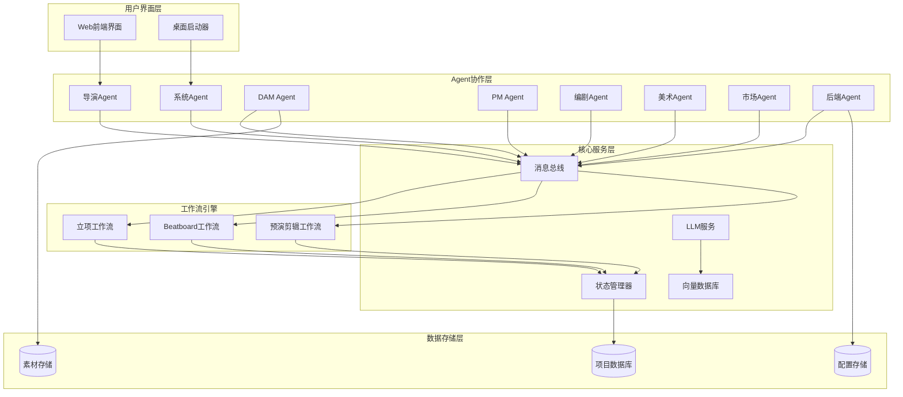

# 多Agent协作工作流核心系统设计文档

## 概述

本设计文档描述了一个基于多Agent协作的智能视频制作系统的核心架构。该系统通过8个专业Agent的协作，实现从项目立项到最终交付的全流程自动化管理。系统采用事件驱动的架构，支持异步处理和实时状态同步。

## 架构

### 系统架构图



### 技术栈选择

- **后端框架**: FastAPI (Python) - 高性能异步API框架
- **前端框架**: React + TypeScript - 现代化Web界面
- **桌面启动器**: CustomTkinter (Python) - 跨平台桌面应用
- **消息总线**: Redis + WebSocket - 实时通信
- **数据库**: PostgreSQL - 关系型数据存储
- **向量数据库**: ChromaDB - 语义搜索和相似度匹配
- **LLM集成**: 支持Ollama本地模型、Gemini、OpenAI (通过统一接口抽象)
- **文件存储**: 本地文件系统 + 云存储支持

## 组件和接口

### Agent基础架构

所有Agent都继承自基础Agent类，提供统一的接口：

```python
class BaseAgent:
    def __init__(self, agent_id: str, message_bus: MessageBus):
        self.agent_id = agent_id
        self.message_bus = message_bus
        self.state = AgentState.IDLE
        
    async def handle_message(self, message: Message) -> Response:
        """处理来自消息总线的消息"""
        pass
        
    async def send_message(self, target_agent: str, content: dict) -> None:
        """向其他Agent发送消息"""
        pass
        
    async def update_state(self, new_state: AgentState) -> None:
        """更新Agent状态"""
        pass
```

### 消息总线接口

```python
class MessageBus:
    async def publish(self, topic: str, message: Message) -> None:
        """发布消息到指定主题"""
        pass
        
    async def subscribe(self, topic: str, handler: Callable) -> None:
        """订阅主题消息"""
        pass
        
    async def request_response(self, target: str, message: Message) -> Response:
        """请求-响应模式通信"""
        pass
```

### 工作流引擎接口

```python
class WorkflowEngine:
    async def start_workflow(self, workflow_type: str, context: dict) -> str:
        """启动指定类型的工作流"""
        pass
        
    async def get_workflow_status(self, workflow_id: str) -> WorkflowStatus:
        """获取工作流状态"""
        pass
        
    async def pause_workflow(self, workflow_id: str) -> None:
        """暂停工作流"""
        pass
        
    async def resume_workflow(self, workflow_id: str) -> None:
        """恢复工作流"""
        pass
```

## 数据模型

### 项目数据模型

```python
class Project(BaseModel):
    id: str
    name: str
    description: str
    aspect_ratio: str  # "16:9", "4:3", "1:1"
    duration: int  # 秒
    story_summary: str
    story_content: str
    status: ProjectStatus
    created_at: datetime
    updated_at: datetime
    agents_assigned: List[str]
    
class ProjectStatus(Enum):
    CREATED = "created"
    IN_PROGRESS = "in_progress"
    BEATBOARD_READY = "beatboard_ready"
    PREVIEW_READY = "preview_ready"
    COMPLETED = "completed"
    ARCHIVED = "archived"
```

### Agent状态模型

```python
class AgentState(Enum):
    IDLE = "idle"
    WORKING = "working"
    WAITING = "waiting"
    ERROR = "error"
    OFFLINE = "offline"

class AgentInfo(BaseModel):
    agent_id: str
    agent_type: str
    state: AgentState
    current_task: Optional[str]
    last_activity: datetime
    capabilities: List[str]
```

### 工作流状态模型

```python
class WorkflowStatus(Enum):
    PENDING = "pending"
    RUNNING = "running"
    PAUSED = "paused"
    COMPLETED = "completed"
    FAILED = "failed"

class WorkflowInstance(BaseModel):
    workflow_id: str
    workflow_type: str
    project_id: str
    status: WorkflowStatus
    current_step: str
    steps_completed: List[str]
    context: dict
    started_at: datetime
    completed_at: Optional[datetime]
```

### 素材数据模型

```python
class Asset(BaseModel):
    id: str
    name: str
    file_path: str
    asset_type: AssetType
    tags: List[str]
    metadata: dict
    created_at: datetime
    file_size: int
    checksum: str

class AssetType(Enum):
    VIDEO = "video"
    AUDIO = "audio"
    IMAGE = "image"
    TEXT = "text"
    MODEL_3D = "model_3d"
```

## 正确性属性分析

让我先进行正确性属性的预工作分析：

<function_calls>
<invoke name="prework">
<parameter name="featureName">multi-agent-workflow-core

## 正确性属性

*属性是一个特征或行为，应该在系统的所有有效执行中保持为真——本质上是关于系统应该做什么的正式陈述。属性作为人类可读规范和机器可验证正确性保证之间的桥梁。*

基于需求分析，以下是系统必须满足的正确性属性：

### 属性 1: Agent初始化完整性
*对于任何*系统启动操作，所有8个Agent（导演、系统、DAM、PM、编剧、美术、市场、后端）都应该成功初始化并建立与消息总线的连接
**验证需求: Requirements 1.1**

### 属性 2: 消息总线通信一致性
*对于任何*Agent间的数据交换，通信都应该通过统一的消息总线进行，不存在直接的点对点通信
**验证需求: Requirements 1.2**

### 属性 3: 导演Agent冲突解决权威性
*对于任何*Agent间的冲突情况，导演Agent应该作为最终决策者成功解决冲突
**验证需求: Requirements 1.3**

### 属性 4: Agent操作日志完整性
*对于任何*Agent执行的任务，系统都应该记录完整的状态变化和操作日志
**验证需求: Requirements 1.4**

### 属性 5: 系统状态查询实时性
*对于任何*用户的状态查询请求，系统Agent应该返回所有Agent的实时准确状态信息
**验证需求: Requirements 1.5**

### 属性 6: 立项工作流触发一致性
*对于任何*用户上传项目文件或输入项目信息的操作，系统都应该正确启动立项工作流
**验证需求: Requirements 2.1**

### 属性 7: LLM信息补全准确性
*对于任何*不完整的项目信息，系统应该识别缺失字段并调用LLM进行准确补全
**验证需求: Requirements 2.2**

### 属性 8: 项目档案生成完整性
*对于任何*补全后的项目信息，生成的项目档案都应该包含建档信息、画幅宽度、时长、故事概要等所有必要字段
**验证需求: Requirements 2.3**

### 属性 9: 人工审核流程正确性
*对于任何*生成的项目档案，系统都应该暂停工作流等待人工审核确认
**验证需求: Requirements 2.4**

### 属性 10: Agent调配协调性
*对于任何*通过人工审核的项目，导演Agent应该成功调配所有相关工作台开始协作
**验证需求: Requirements 2.5**

### 属性 11: 项目归档完整性
*对于任何*完成立项的项目，PM_Agent应该执行完整的项目归档和文件整理操作
**验证需求: Requirements 2.6**

### 属性 12: 场次分析准确性
*对于任何*完成立项的项目，故事板Agent应该准确分析立项信息并合理拆解场次时长
**验证需求: Requirements 3.1**

### 属性 13: 时长评估协作性
*对于任何*场次拆解结果，编剧Agent应该参与协助评估时长的合理性
**验证需求: Requirements 3.2**

### 属性 14: 用户确认等待机制
*对于任何*导演Agent确认的时长方案，系统都应该等待用户的最终确认
**验证需求: Requirements 3.3**

### 属性 15: 向量搜索生成准确性
*对于任何*用户确认的场次时长，系统应该生成准确的向量搜索词条和相似度匹配索引
**验证需求: Requirements 3.4**

### 属性 16: 素材匹配有效性
*对于任何*向量搜索结果，DAM_Agent应该找到相关度高的标签素材
**验证需求: Requirements 3.5**

### 属性 17: 素材装配正确性
*对于任何*匹配的素材，系统应该正确将其装配到对应的故事板位置中
**验证需求: Requirements 3.6**

### 属性 18: 素材确认流程完整性
*对于任何*装配完成的故事板，系统都应该要求用户确认素材信息
**验证需求: Requirements 3.7**

### 属性 19: 预演模式启动正确性
*对于任何*通过确认的Beatboard，系统应该正确启动预演剪辑模式
**验证需求: Requirements 4.1**

### 属性 20: 数据一致性保持
*对于任何*预演模式下的操作，beatboard和剪辑台的信息应该保持完全一致
**验证需求: Requirements 4.2**

### 属性 21: 多端同步选项提供
*对于任何*成功的预演结果，系统应该询问用户是否进行多端同步
**验证需求: Requirements 4.3**

### 属性 22: 多端同步执行正确性
*对于任何*用户选择的多端同步操作，全局Agent应该成功调用多端同步功能
**验证需求: Requirements 4.4**

### 属性 23: 资产检查完整性
*对于任何*完成多端同步的项目，分析Agent应该检查所有资产的完整性和正确性
**验证需求: Requirements 4.5**

### 属性 24: 文件打包处理正确性
*对于任何*通过资产检查的项目，装配Agent应该正确进行文件打包处理
**验证需求: Requirements 4.6**

### 属性 25: 最终审阅完整性
*对于任何*完成文件打包的项目，审阅Agent应该审阅所有代码和多媒体素材
**验证需求: Requirements 4.7**

### 属性 26: 异常检测及时性
*对于任何*Agent出现的异常情况，后端Agent应该及时检测并记录详细的错误信息
**验证需求: Requirements 5.1**

### 属性 27: API监控有效性
*对于任何*API接口问题，后端Agent应该生成准确的报错日志
**验证需求: Requirements 5.2**

### 属性 28: 格式验证强制性
*对于任何*不符合规范的素材格式，系统Agent应该强制接管并提示修复
**验证需求: Requirements 5.3**

### 属性 29: 标签验证准确性
*对于任何*不符合规则的标签命名，系统应该返回明确的错误提示要求修复
**验证需求: Requirements 5.4**

### 属性 30: 路径验证记录完整性
*对于任何*存在问题的文件路径，系统应该在日志中记录并提供修复提示
**验证需求: Requirements 5.5**

### 属性 31: AI辅助功能可用性
*对于任何*用户的文字内容创作需求，系统应该提供LLM AI生成辅助功能
**验证需求: Requirements 6.1**

### 属性 32: AI内容验证有效性
*对于任何*AI生成的内容，系统应该提供有效的辅助验证功能
**验证需求: Requirements 6.2**

### 属性 33: 专业建议提供准确性
*对于任何*用户的内容建议需求，相关Agent应该调用LLM提供专业准确的建议
**验证需求: Requirements 6.3**

### 属性 34: 智能分析功能有效性
*对于任何*需要内容分析的场景，对应Agent应该使用AI进行准确的智能分析
**验证需求: Requirements 6.4**

### 属性 35: AI使用记录完整性
*对于任何*AI辅助操作，系统应该完整记录AI使用情况用于MVP验证
**验证需求: Requirements 6.5**

### 属性 36: 项目文件结构创建完整性
*对于任何*新创建的项目，PM_Agent应该建立完整规范的项目文件结构
**验证需求: Requirements 7.1**

### 属性 37: 中间状态保存实时性
*对于任何*工作流进行中的操作，系统应该实时保存所有中间状态
**验证需求: Requirements 7.2**

### 属性 38: 数据存储规范一致性
*对于任何*Agent产生的数据，都应该按照统一规范进行存储
**验证需求: Requirements 7.3**

### 属性 39: 项目归档生成完整性
*对于任何*完成的项目，PM_Agent应该生成完整的项目归档
**验证需求: Requirements 7.4**

### 属性 40: 项目检索功能准确性
*对于任何*用户的历史项目查询，系统应该提供完整准确的项目检索功能
**验证需求: Requirements 7.5**

### 属性 41: 用户交互界面可用性
*对于任何*用户与Agent的交互需求，系统Agent应该在界面上提供清晰的对话框
**验证需求: Requirements 8.1**

### 属性 42: 确认界面清晰性
*对于任何*Agent需要用户确认的场景，系统应该显示清晰明确的确认界面
**验证需求: Requirements 8.2**

### 属性 43: 进度状态显示准确性
*对于任何*工作流进行中的状态，系统应该显示准确的当前进度和状态信息
**验证需求: Requirements 8.3**

### 属性 44: 错误信息显示及时性
*对于任何*系统错误，都应该通过控制面板及时显示详细的错误信息
**验证需求: Requirements 8.4**

### 属性 45: 智能搜索功能有效性
*对于任何*用户的信息检索需求，系统Agent应该提供准确有效的智能搜索功能
**验证需求: Requirements 8.5**

## 错误处理

### 错误分类

1. **Agent级错误**: 单个Agent内部错误，不影响其他Agent
2. **通信错误**: 消息总线通信失败或超时
3. **工作流错误**: 工作流执行过程中的逻辑错误
4. **数据错误**: 数据验证失败或存储错误
5. **外部服务错误**: LLM服务、数据库等外部依赖错误

### 错误处理策略

```python
class ErrorHandler:
    async def handle_agent_error(self, agent_id: str, error: Exception) -> None:
        """处理Agent级错误"""
        # 1. 记录错误日志
        # 2. 通知后端Agent
        # 3. 尝试重启Agent
        # 4. 如果重启失败，标记Agent为离线状态
        
    async def handle_communication_error(self, source: str, target: str, error: Exception) -> None:
        """处理通信错误"""
        # 1. 记录通信失败
        # 2. 尝试重新建立连接
        # 3. 使用备用通信路径
        # 4. 通知相关Agent通信状态
        
    async def handle_workflow_error(self, workflow_id: str, error: Exception) -> None:
        """处理工作流错误"""
        # 1. 暂停当前工作流
        # 2. 保存当前状态
        # 3. 通知用户错误情况
        # 4. 提供恢复或重试选项
```

### 容错机制

1. **Agent重启**: 自动检测Agent故障并重启
2. **消息重试**: 通信失败时自动重试，支持指数退避
3. **状态恢复**: 从最近的检查点恢复工作流状态
4. **降级服务**: 关键服务不可用时提供基础功能
5. **用户通知**: 及时通知用户系统状态和错误信息

## 测试策略

### 双重测试方法

系统采用单元测试和基于属性的测试相结合的方法：

- **单元测试**: 验证特定示例、边界情况和错误条件
- **属性测试**: 验证所有输入的通用属性
- **集成测试**: 验证Agent间协作和工作流完整性
- **端到端测试**: 验证完整的用户场景

### 基于属性的测试配置

- **测试框架**: Python Hypothesis
- **最小迭代次数**: 每个属性测试100次迭代
- **测试标签格式**: **Feature: multi-agent-workflow-core, Property {number}: {property_text}**
- **覆盖策略**: 每个正确性属性对应一个属性测试

### 测试数据生成策略

```python
# 项目数据生成器
@given(
    name=st.text(min_size=1, max_size=100),
    aspect_ratio=st.sampled_from(["16:9", "4:3", "1:1"]),
    duration=st.integers(min_value=1, max_value=7200),
    story_summary=st.text(min_size=10, max_size=500)
)
def test_project_creation_property(name, aspect_ratio, duration, story_summary):
    """Feature: multi-agent-workflow-core, Property 8: 项目档案生成完整性"""
    # 测试项目档案生成包含所有必要字段
    pass

# Agent状态生成器
@given(
    agent_states=st.lists(
        st.sampled_from(list(AgentState)), 
        min_size=8, 
        max_size=8
    )
)
def test_agent_initialization_property(agent_states):
    """Feature: multi-agent-workflow-core, Property 1: Agent初始化完整性"""
    # 测试所有Agent都能成功初始化
    pass
```

### 性能测试

- **并发测试**: 模拟多用户同时使用系统
- **负载测试**: 测试系统在高负载下的表现
- **压力测试**: 测试系统的极限承受能力
- **稳定性测试**: 长时间运行测试系统稳定性

### 安全测试

- **输入验证**: 测试所有用户输入的验证机制
- **权限控制**: 测试Agent间的权限隔离
- **数据保护**: 测试敏感数据的加密和保护
- **API安全**: 测试API接口的安全性