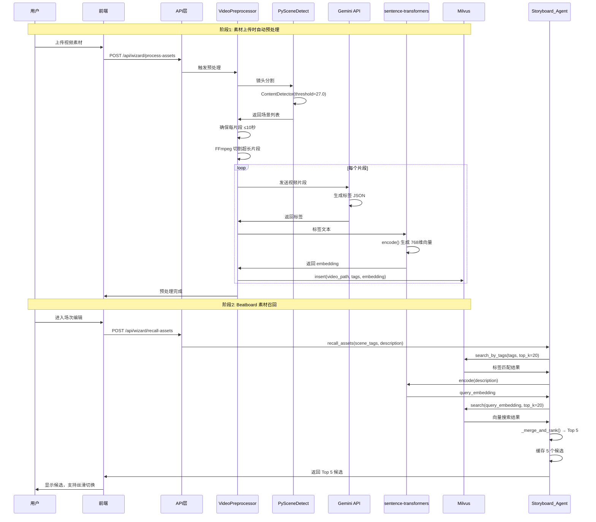

# Agent 协作流程图示

本文档展示 Pervis PRO 导演工作台中 Agent 的完整协作流程，从用户输入项目开始到最终输出。

---

## 零、系统整体架构图（Mermaid）

```mermaid
graph TB
    %% 用户输入层
    subgraph "用户输入层"
        U1[用户上传立项信息]
        U2[散乱文件: 剧本、人物小传、人设、场景、参考内容等]
        U3[项目基本信息: 标题、类型、时长、画幅、帧率]
    end

    %% 前端界面层
    subgraph "前端界面层 (React)"
        PW[ProjectWizard 主组件]
        S1[Step1: 基本信息]
        S2[Step2: 剧本导入]
        S3[Step3: 角色设定]
        S4[Step4: 场次规划]
        S5[Step5: 参考资料]
        S6[Step6: 确认提交]
        
        ASP[AgentStatusPanel<br/>Agent状态面板]
        VHP[VersionHistoryPanel<br/>版本历史面板]
        CS[CandidateSwitcher<br/>候选切换器]
    end

    %% API 层
    subgraph "API 层 (FastAPI)"
        API1[POST /api/wizard/parse-script]
        API2[POST /api/wizard/generate-content]
        API3[POST /api/wizard/process-assets]
        API4[POST /api/wizard/recall-assets]
        API5[GET /api/wizard/task-status/{id}]
    end

    %% Agent 服务层
    subgraph "Agent 服务层"
        AS[AgentService<br/>Agent 任务调度器]
        
        subgraph "Script_Agent"
            SA1[parse_script]
            SA2[generate_logline]
            SA3[generate_synopsis]
            SA4[generate_bio]
        end
        
        subgraph "Art_Agent"
            AA1[classify_file]
            AA2[generate_tags]
        end
        
        subgraph "Director_Agent"
            DA1[review - 审核]
            DA2[check_consistency]
        end
        
        subgraph "PM_Agent"
            PA1[record_version]
            PA2[get_project_context]
        end
        
        subgraph "Storyboard_Agent"
            SBA1[recall_assets - Top 5]
            SBA2[switch_candidate]
            SBA3[rough_cut]
        end
    end

    %% 素材预处理管道
    subgraph "素材预处理管道"
        PP1[PySceneDetect<br/>镜头分割 ≤10秒]
        PP2[Gemini 2.5 Flash<br/>视频标签生成]
        PP3[sentence-transformers<br/>向量生成 768维]
        PP4[Milvus<br/>向量存储 IVF_FLAT]
    end

    %% 数据存储层
    subgraph "数据存储层"
        DB1[(ProjectWizardDraft)]
        DB2[(ContentVersion)]
        DB3[(Milvus Collection)]
    end

    %% 输出层
    subgraph "输出层"
        O1[完整项目档案]
        O2[素材标签数据]
        O3[跳转到 Beatboard]
    end

    %% 连接关系
    U1 --> PW
    U2 --> PW
    U3 --> PW
    
    PW --> S1 --> S2 --> S3 --> S4 --> S5 --> S6
    
    S2 --> API1 --> AS --> SA1
    S3 --> API2 --> AS --> SA4
    S5 --> API3 --> PP1 --> PP2 --> PP3 --> PP4
    
    SA1 --> DA1
    SA4 --> DA1
    AA2 --> DA1
    
    DA1 --> PA1 --> DB2
    PP4 --> DB3
    
    API4 --> SBA1
    SBA1 --> DB3
    SBA1 --> CS
    
    S6 --> O1 --> O2 --> O3

    %% 样式
    classDef userInput fill:#e1f5fe
    classDef frontend fill:#f3e5f5
    classDef api fill:#e8f5e8
    classDef agent fill:#fff3e0
    classDef pipeline fill:#ffebee
    classDef database fill:#fce4ec
    classDef output fill:#e0f2f1

    class U1,U2,U3 userInput
    class PW,S1,S2,S3,S4,S5,S6,ASP,VHP,CS frontend
    class API1,API2,API3,API4,API5 api
    class AS,SA1,SA2,SA3,SA4,AA1,AA2,DA1,DA2,PA1,PA2,SBA1,SBA2,SBA3 agent
    class PP1,PP2,PP3,PP4 pipeline
    class DB1,DB2,DB3 database
    class O1,O2,O3 output
```

---

## 零-A、素材预处理与召回流程（Mermaid）



---

## 零-B、完整项目流程总览（从输入到输出）

```
┌─────────────────────────────────────────────────────────────────────────────────────────────────────┐
│                                    Pervis PRO 完整项目流程                                          │
│                                    (从用户输入到最终输出)                                           │
├─────────────────────────────────────────────────────────────────────────────────────────────────────┤
│                                                                                                      │
│  ╔═══════════════════════════════════════════════════════════════════════════════════════════════╗ │
│  ║                                      用户输入（立项信息）                                      ║ │
│  ╚═══════════════════════════════════════════════════════════════════════════════════════════════╝ │
│                                                                                                      │
│       ┌─────────────┐    ┌─────────────┐    ┌─────────────┐    ┌─────────────┐                     │
│       │  剧本文件   │    │  人物小传   │    │  人设/场景  │    │  参考内容   │                     │
│       │ (TXT/PDF/   │    │ (散乱文档)  │    │ (图片/文档) │    │ (图片/视频) │                     │
│       │  DOCX/FDX)  │    │             │    │             │    │             │                     │
│       └──────┬──────┘    └──────┬──────┘    └──────┬──────┘    └──────┬──────┘                     │
│              │                  │                  │                  │                             │
│              └──────────────────┴──────────────────┴──────────────────┘                             │
│                                         │                                                            │
│                          用户可能上传散乱的文件和命名                                               │
│                          Art_Agent 自动识别分类                                                     │
│                          识别失败时弹窗让用户手动标注                                               │
│                                         │                                                            │
│                                         ▼                                                            │
│  ╔═══════════════════════════════════════════════════════════════════════════════════════════════╗ │
│  ║  阶段 1: 项目立项 (Project Wizard)                                                            ║ │
│  ║                                                                                                ║ │
│  ║  ┌─────────────────────────────────────────────────────────────────────────────────────────┐ ║ │
│  ║  │  Art_Agent (美术 Agent) - 文件处理                                                       │ ║ │
│  ║  │  ├── 输入: 用户上传的散乱文件                                                           │ ║ │
│  ║  │  ├── 工作: 自动识别文件类型、分类、生成缩略图、提取元数据、生成标签                     │ ║ │
│  ║  │  ├── 输出: 分类后的文件列表 + 标签                                                      │ ║ │
│  ║  │  └── 用户确认: 确认文件分类是否正确，手动调整错误分类                                   │ ║ │
│  ║  └─────────────────────────────────────────────────────────────────────────────────────────┘ ║ │
│  ║                                                                                                ║ │
│  ║  ┌─────────────────────────────────────────────────────────────────────────────────────────┐ ║ │
│  ║  │  Script_Agent (编剧 Agent) - 内容解析与生成                                              │ ║ │
│  ║  │  ├── 输入: 分类后的剧本文件、人物小传文档                                               │ ║ │
│  ║  │  ├── 工作:                                                                               │ ║ │
│  ║  │  │   • 解析剧本结构（场次、角色、对话）                                                 │ ║ │
│  ║  │  │   • 生成/补全 Logline、Synopsis                                                      │ ║ │
│  ║  │  │   • 生成/补全人物小传                                                                │ ║ │
│  ║  │  │   • 估算场次时长                                                                     │ ║ │
│  ║  │  ├── 输出: 结构化的剧本数据、角色列表、场次大纲                                         │ ║ │
│  ║  │  └── 用户确认: 确认解析结果、编辑生成内容、接受/拒绝建议                                │ ║ │
│  ║  └─────────────────────────────────────────────────────────────────────────────────────────┘ ║ │
│  ║                                                                                                ║ │
│  ║  ┌─────────────────────────────────────────────────────────────────────────────────────────┐ ║ │
│  ║  │  Director_Agent (导演 Agent) - 审核                                                      │ ║ │
│  ║  │  ├── 输入: Script_Agent 和 Art_Agent 的输出                                             │ ║ │
│  ║  │  ├── 工作:                                                                               │ ║ │
│  ║  │  │   • 规则校验（内容完整性、格式正确性）                                               │ ║ │
│  ║  │  │   • 项目规格一致性检查（时长、画幅、帧率）                                           │ ║ │
│  ║  │  │   • 艺术风格一致性检查                                                               │ ║ │
│  ║  │  │   • 历史版本对比（避免改回被否决版本）                                               │ ║ │
│  ║  │  ├── 输出: 审核结果 + 改进建议                                                          │ ║ │
│  ║  │  └── 用户确认: 查看审核意见、决定是否采纳建议                                           │ ║ │
│  ║  └─────────────────────────────────────────────────────────────────────────────────────────┘ ║ │
│  ║                                                                                                ║ │
│  ║  ┌─────────────────────────────────────────────────────────────────────────────────────────┐ ║ │
│  ║  │  PM_Agent (项目助理) - 版本管理 【用户可见】                                             │ ║ │
│  ║  │  ├── 记录内容:                                                                           │ ║ │
│  ║  │  │   • 项目规格: 时长、画幅、帧率、分辨率                                               │ ║ │
│  ║  │  │   • 版本历史: 每次 Agent 生成的内容版本                                              │ ║ │
│  ║  │  │   • 用户决策: 接受/拒绝/修改的历史                                                   │ ║ │
│  ║  │  │   • 艺术风格: 已确定的视觉风格、对标项目                                             │ ║ │
│  ║  │  ├── 版本命名: 自动写入版本号到文件名                                                   │ ║ │
│  ║  │  │   例如: 角色_张三_v1.json → 角色_张三_v2.json → 角色_张三_v3.json                    │ ║ │
│  ║  │  └── 显示: 在界面上显示当前版本号和修改历史                                             │ ║ │
│  ║  └─────────────────────────────────────────────────────────────────────────────────────────┘ ║ │
│  ║                                                                                                ║ │
│  ║  输出（项目档案）:                                                                            ║ │
│  ║  ┌─────────────────────────────────────────────────────────────────────────────────────────┐ ║ │
│  ║  │ • 项目基本信息: 标题、类型、时长、画幅、帧率                                            │ ║ │
│  ║  │ • 剧本结构: Logline、Synopsis、完整剧本文本                                             │ ║ │
│  ║  │ • 角色列表: 角色名、描述、重要性、人物小传_v{n}                                         │ ║ │
│  ║  │ • 场次大纲: 场次号、场景、时长估算、描述                                                │ ║ │
│  ║  │ • 参考素材库: 分类后的图片/视频 + 标签 + 元数据                                         │ ║ │
│  ║  │ • 版本记录: 所有内容的版本历史                                                          │ ║ │
│  ║  └─────────────────────────────────────────────────────────────────────────────────────────┘ ║ │
│  ╚═══════════════════════════════════════════════════════════════════════════════════════════════╝ │
│                                         │                                                            │
│                                         ▼                                                            │
│  ╔═══════════════════════════════════════════════════════════════════════════════════════════════╗ │
│  ║  阶段 2: 故事板 (Beatboard)                                                                   ║ │
│  ║                                                                                                ║ │
│  ║  ┌─────────────────────────────────────────────────────────────────────────────────────────┐ ║ │
│  ║  │  Art_Agent (美术 Agent) - 素材召回                                                       │ ║ │
│  ║  │  ├── 输入: 场次描述、角色信息、风格标签                                                 │ ║ │
│  ║  │  ├── 素材来源:                                                                           │ ║ │
│  ║  │  │   • 用户上传的参考素材（阶段1收集的）                                                │ ║ │
│  ║  │  │   • 系统素材库（如有）                                                               │ ║ │
│  ║  │  ├── 匹配逻辑:                                                                           │ ║ │
│  ║  │  │   • 基于场次描述生成搜索词条                                                         │ ║ │
│  ║  │  │   • 标签匹配（内容标签、风格标签）                                                   │ ║ │
│  ║  │  │   • 向量相似度匹配（如有向量索引）                                                   │ ║ │
│  ║  │  ├── 输出: 每个场次/镜头的推荐素材列表                                                  │ ║ │
│  ║  │  └── 无匹配时的处理:                                                                     │ ║ │
│  ║  │      • 显示"暂无匹配素材"占位符                                                         │ ║ │
│  ║  │      • 提示用户上传更多参考或手动选择                                                   │ ║ │
│  ║  │      • 扩大搜索范围（降低匹配阈值）                                                     │ ║ │
│  ║  └─────────────────────────────────────────────────────────────────────────────────────────┘ ║ │
│  ║                                                                                                ║ │
│  ║  ┌─────────────────────────────────────────────────────────────────────────────────────────┐ ║ │
│  ║  │  Director_Agent (导演 Agent) - 审核素材匹配                                              │ ║ │
│  ║  │  ├── 审核内容:                                                                           │ ║ │
│  ║  │  │   • 素材与场次描述的相关性                                                           │ ║ │
│  ║  │  │   • 素材与项目风格的一致性                                                           │ ║ │
│  ║  │  │   • 素材质量是否满足要求                                                             │ ║ │
│  ║  │  ├── 输出: 审核通过/建议替换 + 替换建议                                                 │ ║ │
│  ║  │  └── 用户确认: 接受推荐素材 / 手动替换 / 上传新素材                                     │ ║ │
│  ║  └─────────────────────────────────────────────────────────────────────────────────────────┘ ║ │
│  ║                                                                                                ║ │
│  ║  前端展示（故事板界面）:                                                                      ║ │
│  ║  ┌─────────────────────────────────────────────────────────────────────────────────────────┐ ║ │
│  ║  │ ┌─────────────────────────────────────────────────────────────────────────────────────┐│ ║ │
│  ║  ││  场次 1: INT. 咖啡馆 - 日                                                             ││ ║ │
│  ║  ││  ┌─────────┐ ┌─────────┐ ┌─────────┐ ┌─────────┐                                    ││ ║ │
│  ║  ││  │ 镜头 1  │ │ 镜头 2  │ │ 镜头 3  │ │ + 添加  │                                    ││ ║ │
│  ║  ││  │ [缩略图]│ │ [缩略图]│ │ [占位符]│ │         │                                    ││ ║ │
│  ║  ││  │ 全景    │ │ 中景    │ │ 无匹配  │ │         │                                    ││ ║ │
│  ║  ││  │ 3s      │ │ 5s      │ │ 手动选择│ │         │                                    ││ ║ │
│  ║  ││  └─────────┘ └─────────┘ └─────────┘ └─────────┘                                    ││ ║ │
│  ║  │└─────────────────────────────────────────────────────────────────────────────────────┘│ ║ │
│  ║  │ 展示信息: 场次号、场景描述、镜头缩略图、镜头类型、时长、匹配状态                       │ ║ │
│  ║  └─────────────────────────────────────────────────────────────────────────────────────────┘ ║ │
│  ║                                                                                                ║ │
│  ║  输出: 完整故事板（每个场次的镜头序列 + 参考素材 + 时长）                                    ║ │
│  ╚═══════════════════════════════════════════════════════════════════════════════════════════════╝ │
│                                         │                                                            │
│                                         ▼                                                            │
│  ╔═══════════════════════════════════════════════════════════════════════════════════════════════╗ │
│  ║  阶段 3: 预演模式 (Timeline Preview)                                                          ║ │
│  ║                                                                                                ║ │
│  ║  【重要】预演模式是用户的自由工作台，修改不影响之前的故事板和立项信息                         ║ │
│  ║                                                                                                ║ │
│  ║  ┌─────────────────────────────────────────────────────────────────────────────────────────┐ ║ │
│  ║  │  数据隔离:                                                                               │ ║ │
│  ║  │  • 预演数据 ≠ 立项数据                                                                  │ ║ │
│  ║  │  • 用户在预演模式的修改保存在独立的预演版本中                                           │ ║ │
│  ║  │  • 可以随时重置回故事板原始状态                                                         │ ║ │
│  ║  └─────────────────────────────────────────────────────────────────────────────────────────┘ ║ │
│  ║                                                                                                ║ │
│  ║  ┌─────────────────────────────────────────────────────────────────────────────────────────┐ ║ │
│  ║  │  用户操作（自由编辑）:                                                                   │ ║ │
│  ║  │  • 调整镜头顺序                                                                         │ ║ │
│  ║  │  • 修改镜头时长                                                                         │ ║ │
│  ║  │  • 替换素材                                                                             │ ║ │
│  ║  │  • 添加/删除镜头                                                                        │ ║ │
│  ║  │  • 添加音频/音效                                                                        │ ║ │
│  ║  │  • 预览渲染                                                                             │ ║ │
│  ║  └─────────────────────────────────────────────────────────────────────────────────────────┘ ║ │
│  ║                                                                                                ║ │
│  ║  ┌─────────────────────────────────────────────────────────────────────────────────────────┐ ║ │
│  ║  │  Agent 角色（顾问模式，建议可选）:                                                       │ ║ │
│  ║  │                                                                                          │ ║ │
│  ║  │  ┌─────────────┐  ┌─────────────┐  ┌─────────────┐                                     │ ║ │
│  ║  │  │ 导演 Agent  │  │ 美术 Agent  │  │ 编剧 Agent  │                                     │ ║ │
│  ║  │  │             │  │             │  │             │                                     │ ║ │
│  ║  │  │ "这个镜头  │  │ "这个素材  │  │ "这段节奏  │                                     │ ║ │
│  ║  │  │  时长偏长" │  │  风格不统一"│  │  可以加快" │                                     │ ║ │
│  ║  │  │             │  │             │  │             │                                     │ ║ │
│  ║  │  │ [采纳] [忽略]│ │ [采纳] [忽略]│ │ [采纳] [忽略]│                                    │ ║ │
│  ║  │  └─────────────┘  └─────────────┘  └─────────────┘                                     │ ║ │
│  ║  │                                                                                          │ ║ │
│  ║  │  Agent 不强制审核，只在用户需要时提供建议                                               │ ║ │
│  ║  └─────────────────────────────────────────────────────────────────────────────────────────┘ ║ │
│  ║                                                                                                ║ │
│  ║  输出: 可预览的时间线（带音视频的完整序列）                                                  ║ │
│  ╚═══════════════════════════════════════════════════════════════════════════════════════════════╝ │
│                                         │                                                            │
│                                         ▼                                                            │
│  ╔═══════════════════════════════════════════════════════════════════════════════════════════════╗ │
│  ║  阶段 4: 导出 (Export)                                                                        ║ │
│  ║                                                                                                ║ │
│  ║  ┌─────────────────────────────────────────────────────────────────────────────────────────┐ ║ │
│  ║  │  System_Agent (系统 Agent) - 导出前校验 【必须】                                         │ ║ │
│  ║  │  ├── 校验内容:                                                                           │ ║ │
│  ║  │  │   • API 连接状态                                                                     │ ║ │
│  ║  │  │   • 各端口是否正常                                                                   │ ║ │
│  ║  │  │   • FFmpeg 可用性                                                                    │ ║ │
│  ║  │  │   • 存储空间是否充足                                                                 │ ║ │
│  ║  │  │   • 素材文件是否完整（原图是否存在）                                                 │ ║ │
│  ║  │  │   • 导出接口是否正常                                                                 │ ║ │
│  ║  │  ├── 校验结果:                                                                           │ ║ │
│  ║  │  │   • ✅ 全部通过 → 允许导出                                                          │ ║ │
│  ║  │  │   • ❌ 有问题 → 显示问题列表 + 解决建议，阻止导出                                   │ ║ │
│  ║  │  └── 特别注意（开发期）:                                                                 │ ║ │
│  ║  │      • 导出美术图必须是原图（不压缩）                                                   │ ║ │
│  ║  │      • 检查文件格式和接口兼容性                                                         │ ║ │
│  ║  └─────────────────────────────────────────────────────────────────────────────────────────┘ ║ │
│  ║                                                                                                ║ │
│  ║  ┌─────────────────────────────────────────────────────────────────────────────────────────┐ ║ │
│  ║  │  导出选项:                                                                               │ ║ │
│  ║  │  ├── 项目文档 (PDF/DOCX)                                                                │ ║ │
│  ║  │  ├── 故事板序列 (PNG/JPG) - 【必须导出原图】                                            │ ║ │
│  ║  │  ├── 视频 (MP4/MOV) - 【用户可选渲染质量】                                              │ ║ │
│  ║  │  │   • 预览质量 (720p, 快速)                                                            │ ║ │
│  ║  │  │   • 标准质量 (1080p)                                                                 │ ║ │
│  ║  │  │   • 高质量 (4K, 慢速)                                                                │ ║ │
│  ║  │  ├── 音频 (WAV/MP3)                                                                     │ ║ │
│  ║  │  └── NLE 工程 (FCPXML/EDL)                                                              │ ║ │
│  ║  └─────────────────────────────────────────────────────────────────────────────────────────┘ ║ │
│  ║                                                                                                ║ │
│  ║  ┌─────────────────────────────────────────────────────────────────────────────────────────┐ ║ │
│  ║  │  System_Agent - 导出进度监控                                                             │ ║ │
│  ║  │  ├── 实时显示导出进度                                                                   │ ║ │
│  ║  │  ├── 检测导出过程中的问题                                                               │ ║ │
│  ║  │  ├── 导出失败时提供重试选项                                                             │ ║ │
│  ║  │  └── 导出完成后提供下载/打开文件夹选项                                                  │ ║ │
│  ║  └─────────────────────────────────────────────────────────────────────────────────────────┘ ║ │
│  ╚═══════════════════════════════════════════════════════════════════════════════════════════════╝ │
│                                         │                                                            │
│                                         ▼                                                            │
│  ╔═══════════════════════════════════════════════════════════════════════════════════════════════╗ │
│  ║                                      最终输出                                                  ║ │
│  ╚═══════════════════════════════════════════════════════════════════════════════════════════════╝ │
│                                                                                                      │
│       ┌─────────────┐    ┌─────────────┐    ┌─────────────┐    ┌─────────────┐                     │
│       │  项目文档   │    │  故事板序列 │    │  视频/音频  │    │  NLE 工程   │                     │
│       │ (PDF/DOCX)  │    │ (PNG原图)   │    │ (MP4/WAV)   │    │ (XML/EDL)   │                     │
│       └─────────────┘    └─────────────┘    └─────────────┘    └─────────────┘                     │
│                                                                                                      │
└─────────────────────────────────────────────────────────────────────────────────────────────────────┘
```

---

## 一、Agent 职责详细说明

### 1.1 Art_Agent (美术 Agent)

```
┌─────────────────────────────────────────────────────────────────────────────────┐
│                           Art_Agent 职责详解                                     │
├─────────────────────────────────────────────────────────────────────────────────┤
│                                                                                  │
│  【阶段 1: 项目立项】                                                           │
│  ┌─────────────────────────────────────────────────────────────────────────┐   │
│  │  输入: 用户上传的散乱文件（可能命名混乱、格式多样）                       │   │
│  │                                                                          │   │
│  │  工作内容:                                                               │   │
│  │  1. 文件类型识别                                                         │   │
│  │     • 图片 (JPG/PNG/PSD) → 参考图/人设图/场景图                         │   │
│  │     • 视频 (MP4/MOV) → 参考视频                                         │   │
│  │     • 文档 (TXT/PDF/DOCX) → 剧本/人物小传/其他文档                      │   │
│  │                                                                          │   │
│  │  2. 自动分类                                                             │   │
│  │     • 基于文件名关键词                                                   │   │
│  │     • 基于图片内容分析（人物/场景/物品）                                 │   │
│  │     • 基于文档内容分析                                                   │   │
│  │                                                                          │   │
│  │  3. 元数据提取                                                           │   │
│  │     • 分辨率、时长、颜色信息                                             │   │
│  │     • 生成缩略图和代理文件                                               │   │
│  │                                                                          │   │
│  │  4. 标签生成                                                             │   │
│  │     • 内容标签（人物、场景、物品）                                       │   │
│  │     • 风格标签（色调、构图、氛围）                                       │   │
│  │     • 技术标签（分辨率、格式）                                           │   │
│  │                                                                          │   │
│  │  输出: 分类后的文件列表 + 标签 + 元数据                                  │   │
│  │                                                                          │   │
│  │  用户确认:                                                               │   │
│  │  • 确认文件分类是否正确                                                  │   │
│  │  • 手动调整错误分类                                                      │   │
│  │  • 补充/修改标签                                                         │   │
│  └─────────────────────────────────────────────────────────────────────────┘   │
│                                                                                  │
│  【阶段 2: 故事板】                                                             │
│  ┌─────────────────────────────────────────────────────────────────────────┐   │
│  │  输入: 场次描述、角色信息、风格标签                                       │   │
│  │                                                                          │   │
│  │  工作内容:                                                               │   │
│  │  1. 生成搜索词条                                                         │   │
│  │     • 基于场次描述提取关键词                                             │   │
│  │     • 基于角色信息提取关键词                                             │   │
│  │                                                                          │   │
│  │  2. 素材召回                                                             │   │
│  │     • 从用户上传的参考素材中匹配                                         │   │
│  │     • 标签匹配 + 向量相似度匹配                                          │   │
│  │                                                                          │   │
│  │  3. 无匹配处理                                                           │   │
│  │     • 显示"暂无匹配素材"占位符                                           │   │
│  │     • 扩大搜索范围（降低匹配阈值）                                       │   │
│  │     • 提示用户上传更多参考                                               │   │
│  │                                                                          │   │
│  │  输出: 每个场次/镜头的推荐素材列表                                       │   │
│  └─────────────────────────────────────────────────────────────────────────┘   │
│                                                                                  │
└─────────────────────────────────────────────────────────────────────────────────┘
```

### 1.2 Script_Agent (编剧 Agent)

```
┌─────────────────────────────────────────────────────────────────────────────────┐
│                          Script_Agent 职责详解                                   │
├─────────────────────────────────────────────────────────────────────────────────┤
│                                                                                  │
│  【阶段 1: 项目立项】                                                           │
│  ┌─────────────────────────────────────────────────────────────────────────┐   │
│  │  输入: Art_Agent 分类后的剧本文件、人物小传文档                           │   │
│  │                                                                          │   │
│  │  工作内容:                                                               │   │
│  │  1. 剧本解析                                                             │   │
│  │     • 识别场次标题（INT/EXT、场景、日/夜）                               │   │
│  │     • 提取角色名称（从对话中）                                           │   │
│  │     • 提取动作描述和对话内容                                             │   │
│  │                                                                          │   │
│  │  2. 内容生成/补全                                                        │   │
│  │     • Logline（一句话概括）                                              │   │
│  │     • Synopsis（故事概要）                                               │   │
│  │     • 人物小传（基于角色行为和对话）                                     │   │
│  │                                                                          │   │
│  │  3. 时长估算                                                             │   │
│  │     • 基于场次内容估算每个场次时长                                       │   │
│  │     • 计算总时长                                                         │   │
│  │                                                                          │   │
│  │  输出:                                                                   │   │
│  │  • 结构化的剧本数据                                                      │   │
│  │  • 角色列表 + 人物小传                                                   │   │
│  │  • 场次大纲 + 时长估算                                                   │   │
│  │                                                                          │   │
│  │  用户确认:                                                               │   │
│  │  • 确认解析结果是否正确                                                  │   │
│  │  • 编辑生成的内容（Logline、Synopsis、人物小传）                         │   │
│  │  • 接受/拒绝/修改建议                                                    │   │
│  └─────────────────────────────────────────────────────────────────────────┘   │
│                                                                                  │
│  【阶段 3: 预演模式】（顾问角色）                                               │
│  ┌─────────────────────────────────────────────────────────────────────────┐   │
│  │  • 分析剪辑节奏                                                          │   │
│  │  • 提供叙事建议（"这段节奏可以加快"）                                    │   │
│  │  • 建议可选，用户可忽略                                                  │   │
│  └─────────────────────────────────────────────────────────────────────────┘   │
│                                                                                  │
└─────────────────────────────────────────────────────────────────────────────────┘
```


### 1.3 Director_Agent (导演 Agent)

```
┌─────────────────────────────────────────────────────────────────────────────────┐
│                         Director_Agent 职责详解                                  │
├─────────────────────────────────────────────────────────────────────────────────┤
│                                                                                  │
│  【阶段 1: 项目立项】                                                           │
│  ┌─────────────────────────────────────────────────────────────────────────┐   │
│  │  输入: Script_Agent 和 Art_Agent 的输出                                   │   │
│  │                                                                          │   │
│  │  审核流程:                                                               │   │
│  │  1. 规则校验                                                             │   │
│  │     • 内容不为空                                                         │   │
│  │     • 字数在合理范围内                                                   │   │
│  │     • 格式正确                                                           │   │
│  │                                                                          │   │
│  │  2. 项目规格一致性检查（从 PM_Agent 获取上下文）                         │   │
│  │     • 时长是否符合项目设定                                               │   │
│  │     • 画幅是否符合项目设定                                               │   │
│  │     • 帧率是否符合项目设定                                               │   │
│  │                                                                          │   │
│  │  3. 艺术风格一致性检查（使用 LLM）                                       │   │
│  │     • 是否符合已确定的视觉风格                                           │   │
│  │     • 是否符合对标项目的调性                                             │   │
│  │                                                                          │   │
│  │  4. 历史版本对比（从 PM_Agent 获取历史）                                 │   │
│  │     • 是否与之前被否决的版本相似                                         │   │
│  │     • 是否与用户已确认的内容矛盾                                         │   │
│  │     • 避免"改回第一版"的问题                                             │   │
│  │                                                                          │   │
│  │  输出: 审核结果 + 改进建议                                               │   │
│  │                                                                          │   │
│  │  用户确认:                                                               │   │
│  │  • 查看审核意见                                                          │   │
│  │  • 决定是否采纳建议                                                      │   │
│  │  • 强制接受（忽略建议）                                                  │   │
│  └─────────────────────────────────────────────────────────────────────────┘   │
│                                                                                  │
│  【阶段 2: 故事板】                                                             │
│  ┌─────────────────────────────────────────────────────────────────────────┐   │
│  │  审核内容:                                                               │   │
│  │  • 素材与场次描述的相关性                                                │   │
│  │  • 素材与项目风格的一致性                                                │   │
│  │  • 素材质量是否满足要求                                                  │   │
│  │                                                                          │   │
│  │  输出: 审核通过/建议替换 + 替换建议                                      │   │
│  └─────────────────────────────────────────────────────────────────────────┘   │
│                                                                                  │
│  【阶段 3: 预演模式】（顾问角色）                                               │
│  ┌─────────────────────────────────────────────────────────────────────────┐   │
│  │  • 分析镜头时长是否合理                                                  │   │
│  │  • 提供剪辑建议（"这个镜头时长偏长"）                                    │   │
│  │  • 建议可选，用户可忽略                                                  │   │
│  └─────────────────────────────────────────────────────────────────────────┘   │
│                                                                                  │
└─────────────────────────────────────────────────────────────────────────────────┘
```

### 1.4 PM_Agent (项目助理) 【用户可见】

```
┌─────────────────────────────────────────────────────────────────────────────────┐
│                           PM_Agent 职责详解                                      │
│                           【用户可见，显示版本信息】                             │
├─────────────────────────────────────────────────────────────────────────────────┤
│                                                                                  │
│  【记录内容】                                                                   │
│  ┌─────────────────────────────────────────────────────────────────────────┐   │
│  │  1. 项目规格                                                             │   │
│  │     • 时长（秒）                                                         │   │
│  │     • 画幅（16:9, 4:3, 2.35:1 等）                                       │   │
│  │     • 帧率（24, 25, 30 等）                                              │   │
│  │     • 分辨率（1920x1080, 4K 等）                                         │   │
│  │                                                                          │   │
│  │  2. 版本历史                                                             │   │
│  │     • 每次 Agent 生成的内容版本                                          │   │
│  │     • 版本号自动递增                                                     │   │
│  │     • 记录生成时间和生成 Agent                                           │   │
│  │                                                                          │   │
│  │  3. 用户决策                                                             │   │
│  │     • 接受/拒绝/修改的历史                                               │   │
│  │     • 用户反馈（拒绝原因）                                               │   │
│  │                                                                          │   │
│  │  4. 艺术风格                                                             │   │
│  │     • 已确定的视觉风格描述                                               │   │
│  │     • 对标项目列表                                                       │   │
│  │     • 色彩倾向                                                           │   │
│  │     • 情绪基调                                                           │   │
│  └─────────────────────────────────────────────────────────────────────────┘   │
│                                                                                  │
│  【版本命名规则】                                                               │
│  ┌─────────────────────────────────────────────────────────────────────────┐   │
│  │  自动写入版本号到文件名:                                                 │   │
│  │                                                                          │   │
│  │  角色_张三_v1.json  →  角色_张三_v2.json  →  角色_张三_v3.json           │   │
│  │  场次大纲_v1.json   →  场次大纲_v2.json   →  场次大纲_v3.json            │   │
│  │  Logline_v1.txt     →  Logline_v2.txt     →  Logline_v3.txt              │   │
│  │                                                                          │   │
│  │  版本号格式: {内容类型}_{名称}_v{版本号}.{扩展名}                        │   │
│  └─────────────────────────────────────────────────────────────────────────┘   │
│                                                                                  │
│  【界面显示】                                                                   │
│  ┌─────────────────────────────────────────────────────────────────────────┐   │
│  │  ┌─────────────────────────────────────────────────────────────────┐   │   │
│  │  │  📋 项目助理                                                     │   │   │
│  │  │                                                                  │   │   │
│  │  │  当前版本: v3                                                    │   │   │
│  │  │  最后修改: 2024-12-25 14:30                                      │   │   │
│  │  │                                                                  │   │   │
│  │  │  修改历史:                                                       │   │   │
│  │  │  • v3 - 用户修改了人物小传                                       │   │   │
│  │  │  • v2 - 编剧Agent重新生成（用户反馈"太长"）                      │   │   │
│  │  │  • v1 - 编剧Agent首次生成                                        │   │   │
│  │  │                                                                  │   │   │
│  │  │  [查看历史版本] [恢复到v2]                                       │   │   │
│  │  └─────────────────────────────────────────────────────────────────┘   │   │
│  └─────────────────────────────────────────────────────────────────────────┘   │
│                                                                                  │
└─────────────────────────────────────────────────────────────────────────────────┘
```

### 1.5 System_Agent (系统 Agent)

```
┌─────────────────────────────────────────────────────────────────────────────────┐
│                          System_Agent 职责详解                                   │
├─────────────────────────────────────────────────────────────────────────────────┤
│                                                                                  │
│  【阶段 4: 导出前校验】                                                         │
│  ┌─────────────────────────────────────────────────────────────────────────┐   │
│  │  校验项目:                                                               │   │
│  │  ┌─────────────────────────────────────────────────────────────────┐   │   │
│  │  │  ✅ API 连接状态        - 后端服务是否正常                       │   │   │
│  │  │  ✅ 端口状态            - 各服务端口是否可用                     │   │   │
│  │  │  ✅ FFmpeg 可用性       - 视频渲染工具是否正常                   │   │   │
│  │  │  ✅ 存储空间            - 磁盘空间是否充足                       │   │   │
│  │  │  ✅ 素材文件完整性      - 原图是否存在、路径是否正确             │   │   │
│  │  │  ✅ 导出接口            - 导出 API 是否正常响应                  │   │   │
│  │  │  ✅ 文件格式兼容性      - 输出格式是否支持                       │   │   │
│  │  └─────────────────────────────────────────────────────────────────┘   │   │
│  │                                                                          │   │
│  │  校验结果:                                                               │   │
│  │  • ✅ 全部通过 → 显示"系统就绪，可以导出"                               │   │
│  │  • ❌ 有问题 → 显示问题列表 + 解决建议，阻止导出                        │   │
│  │                                                                          │   │
│  │  问题示例:                                                               │   │
│  │  ┌─────────────────────────────────────────────────────────────────┐   │   │
│  │  │  ❌ 导出前检查发现以下问题:                                      │   │   │
│  │  │                                                                  │   │   │
│  │  │  1. 存储空间不足                                                 │   │   │
│  │  │     剩余: 500MB，需要: 2GB                                       │   │   │
│  │  │     [清理缓存] [选择其他位置]                                    │   │   │
│  │  │                                                                  │   │   │
│  │  │  2. 素材文件缺失                                                 │   │   │
│  │  │     缺失: 场景_咖啡馆_01.jpg                                     │   │   │
│  │  │     [重新链接] [跳过此素材]                                      │   │   │
│  │  │                                                                  │   │   │
│  │  │  请解决以上问题后重试导出                                        │   │   │
│  │  └─────────────────────────────────────────────────────────────────┘   │   │
│  └─────────────────────────────────────────────────────────────────────────┘   │
│                                                                                  │
│  【导出进度监控】                                                               │
│  ┌─────────────────────────────────────────────────────────────────────────┐   │
│  │  • 实时显示导出进度                                                      │   │
│  │  • 检测导出过程中的问题                                                  │   │
│  │  • 导出失败时提供重试选项                                                │   │
│  │  • 导出完成后提供下载/打开文件夹选项                                     │   │
│  └─────────────────────────────────────────────────────────────────────────┘   │
│                                                                                  │
│  【开发期特别注意】                                                             │
│  ┌─────────────────────────────────────────────────────────────────────────┐   │
│  │  • 导出美术图必须是原图（不压缩、不降质）                                │   │
│  │  • 检查文件格式和接口兼容性                                              │   │
│  │  • 视频渲染质量由用户选择（预览/标准/高质量）                            │   │
│  └─────────────────────────────────────────────────────────────────────────┘   │
│                                                                                  │
└─────────────────────────────────────────────────────────────────────────────────┘
```


---

## 二、Agent 协作时序图（单个任务示例）

### 2.1 示例：生成人物小传

```
┌─────────────────────────────────────────────────────────────────────────────────┐
│                    生成人物小传 - Agent 协作时序                                 │
├─────────────────────────────────────────────────────────────────────────────────┤
│                                                                                  │
│  时间 ──────────────────────────────────────────────────────────────────────▶   │
│                                                                                  │
│  ┌─────────┐  ┌─────────┐  ┌─────────┐  ┌─────────┐  ┌─────────┐              │
│  │  用户   │  │PM_Agent │  │Script   │  │Director │  │ 前端UI  │              │
│  │         │  │(项目助理)│ │Agent    │  │Agent    │  │         │              │
│  └────┬────┘  └────┬────┘  └────┬────┘  └────┬────┘  └────┬────┘              │
│       │            │            │            │            │                     │
│       │ 点击"生成人物小传"      │            │            │                     │
│       │────────────────────────────────────────────────▶│                     │
│       │            │            │            │            │                     │
│       │            │            │            │            │ 显示:              │
│       │            │            │            │            │ "编剧Agent工作中"  │
│       │            │            │            │            │                     │
│       │            │ 获取项目上下文          │            │                     │
│       │            │◀───────────│            │            │                     │
│       │            │            │            │            │                     │
│       │            │ 返回:      │            │            │                     │
│       │            │ • 项目规格 │            │            │                     │
│       │            │ • 版本历史 │            │            │                     │
│       │            │ • 用户决策 │            │            │                     │
│       │            │───────────▶│            │            │                     │
│       │            │            │            │            │                     │
│       │            │            │ 生成人物小传            │                     │
│       │            │            │ (LLM调用) │            │                     │
│       │            │            │            │            │                     │
│       │            │            │ 完成，提交审核          │                     │
│       │            │            │───────────▶│            │                     │
│       │            │            │            │            │                     │
│       │            │            │            │            │ 显示:              │
│       │            │            │            │            │ "导演Agent审核中"  │
│       │            │            │            │            │                     │
│       │            │ 获取历史版本            │            │                     │
│       │            │◀───────────────────────│            │                     │
│       │            │            │            │            │                     │
│       │            │ 返回版本历史            │            │                     │
│       │            │───────────────────────▶│            │                     │
│       │            │            │            │            │                     │
│       │            │            │            │ 审核:      │                     │
│       │            │            │            │ 1.规则校验 │                     │
│       │            │            │            │ 2.规格一致 │                     │
│       │            │            │            │ 3.风格一致 │                     │
│       │            │            │            │ 4.版本对比 │                     │
│       │            │            │            │            │                     │
│       │            │            │            │ 审核通过   │                     │
│       │            │            │            │───────────▶│                     │
│       │            │            │            │            │                     │
│       │            │            │            │            │ 显示:              │
│       │            │            │            │            │ "审核通过"         │
│       │            │            │            │            │ + 生成结果         │
│       │            │            │            │            │                     │
│       │◀───────────────────────────────────────────────│                     │
│       │            │            │            │            │                     │
│       │ 用户选择: [接受] [修改] [重新生成]   │            │                     │
│       │            │            │            │            │                     │
│       │ 点击"接受"│            │            │            │                     │
│       │───────────▶│            │            │            │                     │
│       │            │            │            │            │                     │
│       │            │ 记录:      │            │            │                     │
│       │            │ • 版本v2   │            │            │                     │
│       │            │ • 决策:接受│            │            │                     │
│       │            │            │            │            │                     │
│       │            │ 更新文件名:│            │            │                     │
│       │            │ 角色_张三_v2.json       │            │                     │
│       │            │            │            │            │                     │
│       │◀───────────│            │            │            │                     │
│       │ 完成       │            │            │            │                     │
│       │            │            │            │            │                     │
│  └────┴────┘  └────┴────┘  └────┴────┘  └────┴────┘  └────┴────┘              │
│                                                                                  │
└─────────────────────────────────────────────────────────────────────────────────┘
```

### 2.2 示例：故事板素材召回

```
┌─────────────────────────────────────────────────────────────────────────────────┐
│                    故事板素材召回 - Agent 协作时序                               │
├─────────────────────────────────────────────────────────────────────────────────┤
│                                                                                  │
│  ┌─────────┐  ┌─────────┐  ┌─────────┐  ┌─────────┐                            │
│  │  用户   │  │Art_Agent│  │Director │  │ 前端UI  │                            │
│  │         │  │(美术)   │  │Agent    │  │         │                            │
│  └────┬────┘  └────┬────┘  └────┬────┘  └────┬────┘                            │
│       │            │            │            │                                   │
│       │ 进入故事板页面          │            │                                   │
│       │────────────────────────────────────▶│                                   │
│       │            │            │            │                                   │
│       │            │            │            │ 加载场次列表                      │
│       │            │            │            │                                   │
│       │            │ 开始素材召回            │                                   │
│       │            │◀───────────────────────│                                   │
│       │            │            │            │                                   │
│       │            │            │            │ 显示:                             │
│       │            │            │            │ "美术Agent匹配素材中..."          │
│       │            │            │            │                                   │
│       │            │ 对每个场次:│            │                                   │
│       │            │ 1.生成搜索词条          │                                   │
│       │            │ 2.标签匹配 │            │                                   │
│       │            │ 3.向量匹配 │            │                                   │
│       │            │            │            │                                   │
│       │            │ 返回匹配结果            │                                   │
│       │            │───────────▶│            │                                   │
│       │            │            │            │                                   │
│       │            │            │ 审核匹配:  │                                   │
│       │            │            │ • 相关性   │                                   │
│       │            │            │ • 风格一致 │                                   │
│       │            │            │ • 质量     │                                   │
│       │            │            │            │                                   │
│       │            │            │ 返回审核结果                                   │
│       │            │            │───────────▶│                                   │
│       │            │            │            │                                   │
│       │            │            │            │ 显示故事板:                       │
│       │            │            │            │ ┌─────┐ ┌─────┐ ┌─────┐         │
│       │            │            │            │ │镜头1│ │镜头2│ │镜头3│         │
│       │            │            │            │ │[图] │ │[图] │ │[无] │         │
│       │            │            │            │ │ 3s  │ │ 5s  │ │手动 │         │
│       │            │            │            │ └─────┘ └─────┘ └─────┘         │
│       │            │            │            │                                   │
│       │◀───────────────────────────────────│                                   │
│       │            │            │            │                                   │
│       │ 用户可以:  │            │            │                                   │
│       │ • 接受推荐素材          │            │                                   │
│       │ • 手动替换素材          │            │                                   │
│       │ • 上传新素材            │            │                                   │
│       │            │            │            │                                   │
│  └────┴────┘  └────┴────┘  └────┴────┘  └────┴────┘                            │
│                                                                                  │
└─────────────────────────────────────────────────────────────────────────────────┘
```


---

## 三、Agent 职责与通信方式总结

```
┌─────────────────────────────────────────────────────────────────────────────────┐
│                        Agent 职责与通信方式总结                                  │
├─────────────────────────────────────────────────────────────────────────────────┤
│                                                                                  │
│  ┌─────────────────────────────────────────────────────────────────────────┐   │
│  │  Agent 列表                                                              │   │
│  │                                                                          │   │
│  │  ┌─────────────────────────────────────────────────────────────────┐   │   │
│  │  │  Art_Agent (美术 Agent)                                          │   │   │
│  │  │  ├── 阶段1: 文件识别、分类、标签生成、缩略图生成                │   │   │
│  │  │  ├── 阶段2: 素材召回、匹配推荐                                  │   │   │
│  │  │  ├── 阶段3: 顾问模式，提供风格建议（可选）                      │   │   │
│  │  │  ├── 可见性: ✅ 用户可见                                        │   │   │
│  │  │  └── 状态显示: "美术 Agent 正在工作..."                         │   │   │
│  │  └─────────────────────────────────────────────────────────────────┘   │   │
│  │                                                                          │   │
│  │  ┌─────────────────────────────────────────────────────────────────┐   │   │
│  │  │  Script_Agent (编剧 Agent)                                       │   │   │
│  │  │  ├── 阶段1: 剧本解析、内容生成、时长估算                        │   │   │
│  │  │  ├── 阶段3: 顾问模式，提供叙事建议（可选）                      │   │   │
│  │  │  ├── 可见性: ✅ 用户可见                                        │   │   │
│  │  │  └── 状态显示: "编剧 Agent 正在工作..."                         │   │   │
│  │  └─────────────────────────────────────────────────────────────────┘   │   │
│  │                                                                          │   │
│  │  ┌─────────────────────────────────────────────────────────────────┐   │   │
│  │  │  Director_Agent (导演 Agent)                                     │   │   │
│  │  │  ├── 阶段1: 审核 Script_Agent 和 Art_Agent 的输出               │   │   │
│  │  │  ├── 阶段2: 审核素材匹配结果                                    │   │   │
│  │  │  ├── 阶段3: 顾问模式，提供剪辑建议（可选）                      │   │   │
│  │  │  ├── 可见性: ✅ 用户可见                                        │   │   │
│  │  │  ├── 状态显示: "导演 Agent 审核中..."                           │   │   │
│  │  │  └── 特点: 有项目记忆，了解项目规格和历史决策                   │   │   │
│  │  └─────────────────────────────────────────────────────────────────┘   │   │
│  │                                                                          │   │
│  │  ┌─────────────────────────────────────────────────────────────────┐   │   │
│  │  │  PM_Agent (项目助理)                                             │   │   │
│  │  │  ├── 全程: 记录项目规格、版本历史、用户决策                     │   │   │
│  │  │  ├── 版本命名: 自动写入版本号到文件名                           │   │   │
│  │  │  ├── 可见性: ✅ 用户可见（显示版本信息）                        │   │   │
│  │  │  └── 界面显示: 当前版本号、修改历史、恢复选项                   │   │   │
│  │  └─────────────────────────────────────────────────────────────────┘   │   │
│  │                                                                          │   │
│  │  ┌─────────────────────────────────────────────────────────────────┐   │   │
│  │  │  System_Agent (系统 Agent)                                       │   │   │
│  │  │  ├── 阶段4: 导出前校验（API、端口、FFmpeg、存储、素材完整性）   │   │   │
│  │  │  ├── 阶段4: 导出进度监控、问题处理                              │   │   │
│  │  │  ├── 可见性: ✅ 用户可见（悬浮 UI）                             │   │   │
│  │  │  └── 特点: 常驻运行，实时推送状态                               │   │   │
│  │  └─────────────────────────────────────────────────────────────────┘   │   │
│  └─────────────────────────────────────────────────────────────────────────┘   │
│                                                                                  │
│  ┌─────────────────────────────────────────────────────────────────────────┐   │
│  │  通信方式                                                                │   │
│  │                                                                          │   │
│  │  MVP 阶段:                                                              │   │
│  │  ┌─────────────────────────────────────────────────────────────────┐   │   │
│  │  │  前端 ◀──── REST API + 轮询 ────▶ 后端 AgentService             │   │   │
│  │  │  前端 ◀──── WebSocket ────▶ 后端 EventService (System_Agent)    │   │   │
│  │  └─────────────────────────────────────────────────────────────────┘   │   │
│  └─────────────────────────────────────────────────────────────────────────┘   │
│                                                                                  │
│  ┌─────────────────────────────────────────────────────────────────────────┐   │
│  │  用户体验目标                                                            │   │
│  │                                                                          │   │
│  │  ✅ 给用户感觉有一个一直跟进项目的导演                                  │   │
│  │  ✅ 导演懂项目基本属性（时长、画幅、风格）                              │   │
│  │  ✅ 导演记得之前的决策，不会改着改着改回第一版                          │   │
│  │  ✅ 每个 Agent 的工作状态清晰可见                                       │   │
│  │  ✅ 用户始终有最终决定权                                                │   │
│  │  ✅ 预演模式是用户的自由工作台，Agent 只提供建议                        │   │
│  │  ✅ 版本历史清晰可追溯，可随时恢复                                      │   │
│  └─────────────────────────────────────────────────────────────────────────┘   │
│                                                                                  │
└─────────────────────────────────────────────────────────────────────────────────┘
```

---

## 四、各阶段 Agent 参与总结表

| 阶段 | Art_Agent | Script_Agent | Director_Agent | PM_Agent | System_Agent |
|------|-----------|--------------|----------------|----------|--------------|
| **阶段1: 立项** | 文件识别分类、标签生成 | 剧本解析、内容生成 | 审核所有输出 | 记录版本和决策 | - |
| **阶段2: 故事板** | 素材召回匹配 | - | 审核匹配结果 | 记录版本 | - |
| **阶段3: 预演** | 顾问（可选） | 顾问（可选） | 顾问（可选） | 记录版本 | - |
| **阶段4: 导出** | - | - | - | - | 导出前校验、进度监控 |

---

## 五、关键设计决策

1. **PM_Agent 用户可见**：显示版本号和修改历史，让用户了解项目迭代过程
2. **版本号写入命名**：`角色_张三_v3.json`，直观展示版本
3. **预演模式数据隔离**：预演修改不影响立项数据，可随时重置
4. **Agent 顾问模式**：阶段3中 Agent 只提供建议，不强制审核
5. **导出前强制校验**：System_Agent 必须校验通过才能导出
6. **美术图导出原图**：开发期特别注意，不压缩不降质
7. **视频渲染质量可选**：用户可选预览/标准/高质量

