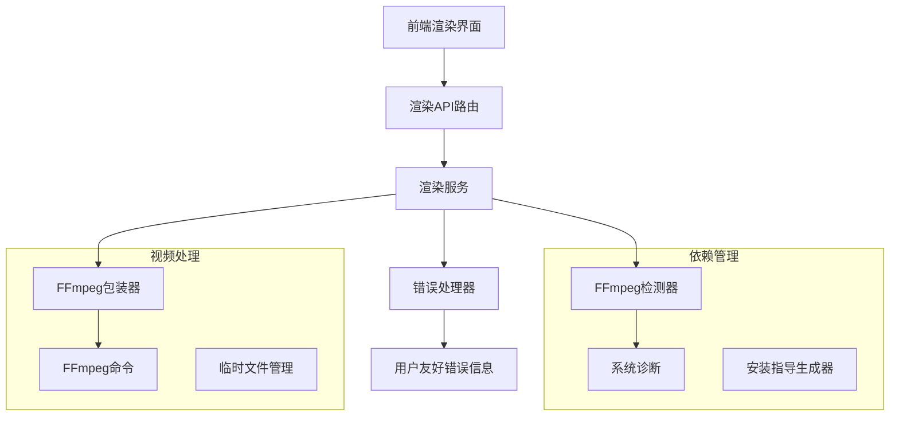
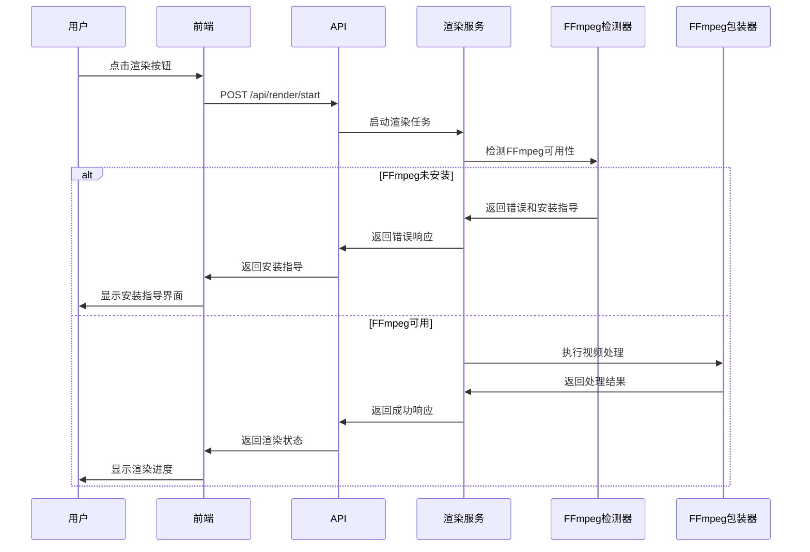

# FFmpeg安装和视频导出功能修复设计文档

## 概述

本设计文档描述了如何解决当前系统中FFmpeg缺失导致的视频导出功能问题。设计包括FFmpeg依赖检测、安装指导、错误处理改进和用户体验优化等方面。

## 架构

### 系统架构图



### 组件交互流程



## 组件和接口

### 1. FFmpeg检测器 (FFmpegDetector)

负责检测系统中FFmpeg的安装状态和版本信息。

```python
class FFmpegDetector:
    def check_installation(self) -> FFmpegStatus
    def get_version(self) -> str
    def get_installation_guide(self) -> InstallationGuide
    def validate_version(self, min_version: str) -> bool
```

### 2. 安装指导生成器 (InstallationGuideGenerator)

根据操作系统生成相应的FFmpeg安装指导。

```python
class InstallationGuideGenerator:
    def generate_guide(self, os_type: str) -> InstallationGuide
    def get_download_links(self) -> Dict[str, str]
    def get_package_manager_commands(self) -> Dict[str, str]
```

### 3. 增强的错误处理器 (EnhancedErrorHandler)

提供用户友好的错误信息和解决方案。

```python
class EnhancedErrorHandler:
    def handle_ffmpeg_error(self, error: Exception) -> UserFriendlyError
    def generate_solution_suggestions(self, error_type: str) -> List[str]
    def log_diagnostic_info(self, context: Dict) -> None
```

### 4. 渲染前置检查器 (RenderPreflightChecker)

在渲染开始前进行全面的系统检查。

```python
class RenderPreflightChecker:
    def check_dependencies(self) -> CheckResult
    def check_disk_space(self, estimated_size: int) -> bool
    def check_file_permissions(self, paths: List[str]) -> bool
    def check_timeline_validity(self, timeline_id: str) -> bool
```

## 数据模型

### FFmpeg状态模型

```python
@dataclass
class FFmpegStatus:
    is_installed: bool
    version: Optional[str]
    path: Optional[str]
    is_version_supported: bool
    installation_guide: Optional[InstallationGuide]
```

### 安装指导模型

```python
@dataclass
class InstallationGuide:
    os_type: str
    method: str  # "package_manager", "binary", "source"
    commands: List[str]
    download_url: Optional[str]
    notes: List[str]
```

### 用户友好错误模型

```python
@dataclass
class UserFriendlyError:
    error_code: str
    title: str
    message: str
    solutions: List[str]
    documentation_link: Optional[str]
    is_recoverable: bool
```

## 正确性属性

*属性是一个特征或行为，应该在系统的所有有效执行中保持为真——本质上，是关于系统应该做什么的正式声明。属性作为人类可读规范和机器可验证正确性保证之间的桥梁。*

### 属性反思

在编写具体属性之前，我需要识别和消除冗余：

- 属性1.1和1.2可以合并为一个综合的FFmpeg检测属性
- 属性2.2和2.3可以合并为渲染状态管理属性  
- 属性3.1和3.2可以合并为错误处理属性
- 格式和分辨率支持属性(4.1-4.3)可以合并为配置验证属性

### 核心属性

**属性 1: FFmpeg依赖检测**
*对于任何* 系统启动或检测请求，系统应该正确识别FFmpeg的安装状态，并在未安装时提供相应的安装指导信息
**验证: 需求 1.1, 1.2, 1.4, 1.5**

**属性 2: 渲染前置条件验证**  
*对于任何* 渲染请求，系统应该验证所有必要的前置条件（FFmpeg可用性、磁盘空间、文件权限等），并在条件不满足时阻止渲染
**验证: 需求 2.1, 3.3**

**属性 3: 渲染状态一致性**
*对于任何* 渲染任务，其状态应该按照pending -> processing -> completed/failed的顺序变化，进度值应该在0-100范围内单调递增
**验证: 需求 2.2, 2.3**

**属性 4: 错误处理完整性**
*对于任何* FFmpeg相关错误，系统应该记录详细日志并向用户提供包含错误信息和解决建议的响应
**验证: 需求 2.4, 3.1, 3.2**

**属性 5: 资源清理保证**
*对于任何* 被取消或失败的渲染任务，系统应该清理所有相关的临时文件和进程资源
**验证: 需求 2.5**

**属性 6: 配置参数验证**
*对于任何* 用户输入的渲染配置（格式、分辨率、比特率等），系统应该验证其有效性并拒绝无效值
**验证: 需求 4.1, 4.2, 4.3, 4.5**

**属性 7: 代理模式文件选择**
*对于任何* 启用代理模式的渲染任务，系统应该在编辑时使用代理文件路径，在最终渲染时使用原始文件路径
**验证: 需求 4.4**

## 错误处理

### 错误分类和处理策略

#### 1. 依赖缺失错误
- **FFmpeg未安装**: 返回安装指导，阻止渲染操作
- **FFmpeg版本过低**: 提示升级，提供下载链接
- **FFmpeg路径问题**: 提供PATH配置指导

#### 2. 系统资源错误
- **磁盘空间不足**: 提前检查，建议清理空间或选择其他位置
- **内存不足**: 建议使用代理文件模式或降低质量设置
- **文件权限错误**: 提供权限修复指导

#### 3. 渲染过程错误
- **视频格式不支持**: 提示转换为支持格式
- **编码失败**: 记录详细日志，建议降低质量或更换格式
- **网络存储错误**: 自动切换到本地存储

#### 4. 用户输入错误
- **无效配置参数**: 实时验证，提供有效范围提示
- **空时间轴**: 阻止渲染，提示添加内容
- **缺失素材文件**: 列出缺失文件，建议重新导入

### 错误恢复机制

```python
class ErrorRecoveryStrategy:
    def auto_retry(self, error: Exception, max_attempts: int = 3) -> bool
    def fallback_to_proxy(self, render_options: RenderOptions) -> RenderOptions
    def switch_to_local_storage(self, output_path: str) -> str
    def reduce_quality_settings(self, options: RenderOptions) -> RenderOptions
```

## 测试策略

### 单元测试

#### FFmpeg检测器测试
- 测试在FFmpeg存在和不存在情况下的检测结果
- 测试版本解析和比较逻辑
- 测试不同操作系统下的路径检测

#### 渲染服务测试
- 测试前置条件检查逻辑
- 测试渲染状态转换
- 测试错误处理和恢复机制

#### 配置验证测试
- 测试各种有效和无效的配置参数
- 测试边界值和异常输入
- 测试配置组合的兼容性

### 属性基础测试

使用**pytest-hypothesis**作为属性测试库，配置每个测试运行最少100次迭代。

#### 属性测试实现

**属性 1: FFmpeg依赖检测**
```python
@given(ffmpeg_installed=st.booleans(), version=st.text())
def test_ffmpeg_detection_property(ffmpeg_installed, version):
    # **Feature: ffmpeg-installation-fix, Property 1: FFmpeg依赖检测**
    detector = FFmpegDetector()
    status = detector.check_installation()
    
    if not ffmpeg_installed:
        assert status.installation_guide is not None
        assert len(status.installation_guide.commands) > 0
```

**属性 2: 渲染前置条件验证**
```python
@given(timeline_data=timeline_generator())
def test_render_preflight_property(timeline_data):
    # **Feature: ffmpeg-installation-fix, Property 2: 渲染前置条件验证**
    checker = RenderPreflightChecker()
    result = checker.check_dependencies()
    
    if not result.can_render:
        assert len(result.errors) > 0
        assert all(error.strip() for error in result.errors)
```

**属性 3: 渲染状态一致性**
```python
@given(render_task=render_task_generator())
def test_render_status_consistency_property(render_task):
    # **Feature: ffmpeg-installation-fix, Property 3: 渲染状态一致性**
    service = RenderService(mock_db)
    
    # 状态应该按顺序变化
    assert render_task.progress >= 0.0 and render_task.progress <= 100.0
    
    if render_task.status == 'completed':
        assert render_task.progress == 100.0
        assert render_task.output_path is not None
```

**属性 4: 错误处理完整性**
```python
@given(ffmpeg_error=ffmpeg_error_generator())
def test_error_handling_completeness_property(ffmpeg_error):
    # **Feature: ffmpeg-installation-fix, Property 4: 错误处理完整性**
    handler = EnhancedErrorHandler()
    user_error = handler.handle_ffmpeg_error(ffmpeg_error)
    
    assert user_error.title is not None and len(user_error.title.strip()) > 0
    assert user_error.message is not None and len(user_error.message.strip()) > 0
    assert len(user_error.solutions) > 0
```

**属性 5: 资源清理保证**
```python
@given(task_id=st.text(min_size=1))
def test_resource_cleanup_property(task_id):
    # **Feature: ffmpeg-installation-fix, Property 5: 资源清理保证**
    service = RenderService(mock_db)
    
    # 取消任务后应该清理资源
    service.cancel_render(task_id)
    
    # 验证临时文件被清理
    temp_files = glob.glob(f"storage/temp/*{task_id}*")
    assert len(temp_files) == 0
```

**属性 6: 配置参数验证**
```python
@given(render_options=render_options_generator())
def test_config_validation_property(render_options):
    # **Feature: ffmpeg-installation-fix, Property 6: 配置参数验证**
    validator = ConfigValidator()
    result = validator.validate(render_options)
    
    if render_options.bitrate and render_options.bitrate < 100:
        assert not result.is_valid
        assert any("bitrate" in error.lower() for error in result.errors)
```

**属性 7: 代理模式文件选择**
```python
@given(use_proxy=st.booleans(), asset_data=asset_generator())
def test_proxy_mode_file_selection_property(use_proxy, asset_data):
    # **Feature: ffmpeg-installation-fix, Property 7: 代理模式文件选择**
    service = RenderService(mock_db)
    
    selected_path = service._select_source_file(asset_data, use_proxy)
    
    if use_proxy and asset_data.proxy_path:
        assert selected_path == asset_data.proxy_path
    else:
        assert selected_path == asset_data.original_path
```

### 集成测试

#### 端到端渲染流程测试
- 测试完整的渲染工作流程
- 测试不同配置组合下的渲染结果
- 测试错误场景下的系统行为

#### API集成测试
- 测试前端和后端的API交互
- 测试渲染状态的实时更新
- 测试文件下载功能

### 性能测试

#### 渲染性能基准
- 测试不同视频长度和质量设置下的渲染时间
- 测试并发渲染任务的系统表现
- 测试内存和CPU使用情况

#### 错误检测性能
- 测试FFmpeg检测的响应时间
- 测试前置条件检查的效率
- 测试大量错误日志的处理性能

## 实现注意事项

### 跨平台兼容性
- Windows: 支持通过Chocolatey或手动安装
- macOS: 支持通过Homebrew安装
- Linux: 支持通过包管理器安装

### 安全考虑
- 验证FFmpeg可执行文件的完整性
- 限制渲染输出路径，防止路径遍历攻击
- 清理用户输入，防止命令注入

### 性能优化
- 使用异步处理避免阻塞主线程
- 实现渲染队列管理多个并发任务
- 优化临时文件的创建和清理

### 监控和日志
- 记录所有FFmpeg命令和输出
- 监控渲染任务的资源使用情况
- 提供详细的诊断信息用于故障排除