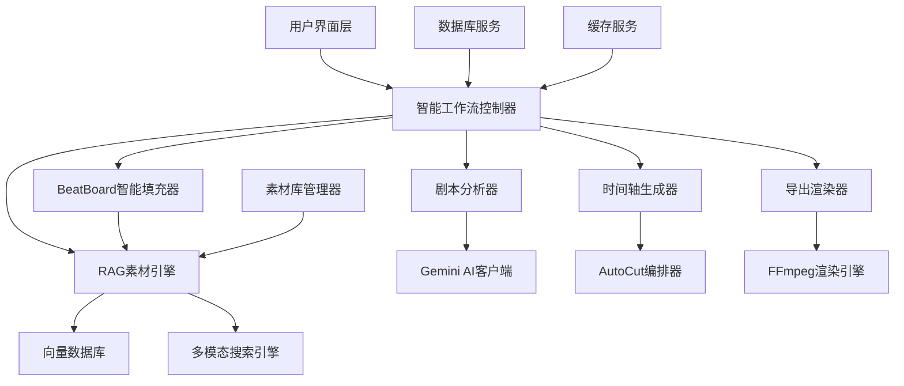

# 智能工作流系统设计文档

## 概述

智能工作流系统是PreVis Pro的核心升级，旨在解决当前系统中素材库缺乏智能识别、时间轴无法自动生成、BeatBoard无法智能填充以及导出功能无响应等关键问题。系统将实现从剧本输入到最终成片导出的完整智能化工作流。

## 架构

### 系统架构图



### 核心组件关系

- **智能工作流控制器**: 统一调度所有智能模块，管理整体流程状态
- **剧本分析器**: 基于现有ScriptProcessor，增强智能分析能力
- **RAG素材引擎**: 扩展现有MultimodalSearchEngine，实现智能素材匹配
- **BeatBoard智能填充器**: 新组件，自动为故事板填充匹配素材
- **时间轴生成器**: 增强现有TimelineService，支持智能自动生成
- **导出渲染器**: 修复现有RenderService，确保导出功能正常工作

## 组件和接口

### 1. 智能工作流控制器 (IntelligentWorkflowController)

```python
class IntelligentWorkflowController:
    async def start_workflow(self, script_text: str, project_id: str) -> WorkflowSession
    async def get_workflow_status(self, session_id: str) -> WorkflowStatus
    async def cancel_workflow(self, session_id: str) -> bool
    async def retry_failed_step(self, session_id: str, step_name: str) -> bool
```

**职责**:
- 管理整个智能工作流的生命周期
- 协调各个智能模块的执行顺序
- 提供统一的进度反馈和错误处理
- 管理工作流会话状态

### 2. 增强剧本分析器 (EnhancedScriptAnalyzer)

```python
class EnhancedScriptAnalyzer:
    async def analyze_with_progress(self, script_text: str, callback: ProgressCallback) -> AnalysisResult
    async def extract_scene_metadata(self, beats: List[Beat]) -> List[SceneMetadata]
    async def suggest_asset_types(self, analysis_result: AnalysisResult) -> List[AssetTypeSuggestion]
```

**增强功能**:
- 实时进度反馈
- 更详细的场景元数据提取
- 智能素材类型建议
- 错误恢复机制

### 3. RAG素材引擎 (RAGAssetEngine)

```python
class RAGAssetEngine:
    async def index_asset_with_features(self, asset_id: str) -> IndexResult
    async def smart_match_assets(self, scene_description: str, filters: Dict) -> List[AssetMatch]
    async def get_similarity_explanation(self, asset_id: str, query: str) -> str
    async def suggest_missing_assets(self, unmatched_scenes: List[str]) -> List[AssetSuggestion]
```

**核心功能**:
- 多模态特征提取和向量化
- 智能语义匹配
- 相关度评分和解释
- 缺失素材类型建议

### 4. BeatBoard智能填充器 (SmartBeatBoardFiller)

```python
class SmartBeatBoardFiller:
    async def auto_fill_beatboard(self, beats: List[Beat], project_id: str) -> FilledBeatBoard
    async def get_asset_alternatives(self, beat_id: str, current_asset_id: str) -> List[AssetAlternative]
    async def update_scene_asset(self, beat_id: str, new_asset_id: str) -> UpdateResult
    async def generate_preview_suggestions(self, beatboard: FilledBeatBoard) -> List[EditSuggestion]
```

**新功能**:
- 自动素材匹配和填充
- 智能替换建议
- 实时预览更新
- 编辑建议生成

### 5. 智能时间轴生成器 (SmartTimelineGenerator)

```python
class SmartTimelineGenerator:
    async def generate_from_beatboard(self, beatboard: FilledBeatBoard) -> Timeline
    async def auto_adjust_durations(self, timeline: Timeline) -> Timeline
    async def optimize_transitions(self, timeline: Timeline) -> Timeline
    async def validate_timeline_integrity(self, timeline: Timeline) -> ValidationResult
```

**智能功能**:
- 基于BeatBoard自动生成时间轴
- 智能时长调整
- 自动转场优化
- 完整性验证

### 6. 增强导出渲染器 (EnhancedExportRenderer)

```python
class EnhancedExportRenderer:
    async def validate_export_requirements(self, timeline_id: str) -> ValidationResult
    async def start_render_with_progress(self, timeline_id: str, options: RenderOptions) -> RenderTask
    async def get_render_progress(self, task_id: str) -> RenderProgress
    async def handle_render_errors(self, task_id: str) -> ErrorRecoveryOptions
```

**修复和增强**:
- 导出前完整性验证
- 实时渲染进度反馈
- 智能错误处理和恢复
- 多格式支持优化

## 数据模型

### 工作流会话模型

```python
class WorkflowSession:
    id: str
    project_id: str
    status: WorkflowStatus  # pending, analyzing, matching, generating, rendering, completed, failed
    current_step: str
    progress: float  # 0.0 - 1.0
    steps_completed: List[str]
    error_info: Optional[ErrorInfo]
    created_at: datetime
    updated_at: datetime
```

### 场景元数据模型

```python
class SceneMetadata:
    beat_id: str
    scene_type: str  # dialogue, action, emotion, transition
    complexity_score: float
    suggested_duration: float
    visual_keywords: List[str]
    audio_keywords: List[str]
    emotion_intensity: float
    required_asset_types: List[str]
```

### 素材匹配结果模型

```python
class AssetMatch:
    asset_id: str
    filename: str
    confidence_score: float
    match_reasons: List[str]
    visual_similarity: float
    semantic_similarity: float
    audio_similarity: float
    alternative_assets: List[str]
```

### 填充后的BeatBoard模型

```python
class FilledBeatBoard:
    project_id: str
    beats: List[FilledBeat]
    total_estimated_duration: float
    coverage_percentage: float  # 有素材匹配的Beat百分比
    quality_score: float  # 整体匹配质量评分
```

### 智能时间轴模型

```python
class SmartTimeline:
    id: str
    project_id: str
    clips: List[SmartClip]
    total_duration: float
    auto_generated: bool
    optimization_applied: bool
    validation_status: ValidationStatus
```

## 正确性属性

*属性是一个特征或行为，应该在系统的所有有效执行中保持为真——本质上，是关于系统应该做什么的正式声明。属性作为人类可读规范和机器可验证正确性保证之间的桥梁。*

### 属性 1: 工作流进度一致性
*对于任何*工作流会话，当前进度值应该与已完成步骤的数量成正比，且进度值始终在0.0到1.0之间
**验证: 需求 1.1, 2.4, 4.2, 5.2, 6.1**

### 属性 2: 剧本分析数据完整性
*对于任何*有效的剧本文本，分析完成后应该包含场景数量、关键词列表、建议素材类型和每个场景的详细标签
**验证: 需求 1.2, 1.5**

### 属性 3: 素材向量化一致性
*对于任何*成功分析的素材，系统应该为其生成语义向量并正确建立索引，使其可以被搜索引擎检索
**验证: 需求 2.1, 2.2**

### 属性 4: 语义匹配排序正确性
*对于任何*场景描述查询，返回的素材列表应该按相关度评分降序排列，且所有评分都在0.0到1.0之间
**验证: 需求 2.3**

### 属性 5: BeatBoard自动填充完整性
*对于任何*剧本分析结果，BeatBoard智能填充器应该为每个场景分配素材，且每个分配都包含相关度评分和替换选项
**验证: 需求 3.1, 3.2**

### 属性 6: 素材替换数据一致性
*对于任何*素材替换操作，系统应该更新相关场景数据并重新计算时间轴，保持数据的一致性
**验证: 需求 3.4, 4.5**

### 属性 7: 时间轴生成逻辑正确性
*对于任何*确认的BeatBoard内容，生成的时间轴应该保持场景的原始顺序，且总时长等于所有片段时长之和
**验证: 需求 4.1**

### 属性 8: 素材时长自动适配
*对于任何*时长不匹配的素材，时间轴生成器应该自动调整播放速度或截取片段，使其符合场景需求
**验证: 需求 4.3**

### 属性 9: 导出前验证完整性
*对于任何*导出请求，系统应该验证时间轴的完整性，包括素材文件存在性和时间范围有效性
**验证: 需求 5.1**

### 属性 10: 渲染进度单调性
*对于任何*进行中的渲染任务，进度值应该单调递增，且在任务完成时达到100%
**验证: 需求 5.2, 5.4**

### 属性 11: 多格式导出支持
*对于任何*有效的导出格式选择，系统应该支持相应的分辨率和编码参数配置
**验证: 需求 5.5**

### 属性 12: 错误处理和恢复一致性
*对于任何*处理步骤失败，系统应该记录详细错误信息并提供重试或跳过选项，且错误不会影响其他步骤
**验证: 需求 1.3, 5.3, 6.3**

### 属性 13: 工作流自动化触发
*对于任何*完成的处理步骤，系统应该自动触发下一个相关步骤，无需用户手动干预
**验证: 需求 1.4, 3.1**

### 属性 14: 资源管理和清理
*对于任何*取消的操作或完成的工作流，系统应该安全清理所有临时文件和释放占用的资源
**验证: 需求 6.2, 6.4**

### 属性 15: 系统状态一致性
*对于任何*时刻，智能工作流系统应该能够准确报告当前状态和下一步操作建议
**验证: 需求 6.1, 6.5**

## 错误处理

### 错误分类和处理策略

1. **输入验证错误**: 剧本格式无效、素材文件损坏
   - 立即返回详细错误信息
   - 提供格式要求和修复建议

2. **处理超时错误**: AI分析超时、渲染超时
   - 自动重试机制（最多3次）
   - 提供降级处理选项

3. **资源不足错误**: 内存不足、磁盘空间不足
   - 暂停当前处理
   - 提供资源释放建议

4. **依赖服务错误**: Gemini API失败、数据库连接失败
   - 使用备用处理方案
   - 记录详细错误日志

### 错误恢复机制

```python
class ErrorRecoveryManager:
    async def handle_analysis_failure(self, session_id: str, error: Exception) -> RecoveryAction
    async def handle_matching_failure(self, session_id: str, error: Exception) -> RecoveryAction
    async def handle_generation_failure(self, session_id: str, error: Exception) -> RecoveryAction
    async def handle_render_failure(self, task_id: str, error: Exception) -> RecoveryAction
```

## 测试策略

### 单元测试

- **组件隔离测试**: 每个智能模块的独立功能测试
- **接口契约测试**: 验证组件间接口的正确性
- **错误场景测试**: 各种异常情况的处理验证
- **性能基准测试**: 关键操作的性能指标验证

### 属性基于测试 (Property-Based Testing)

使用**Hypothesis**库进行属性基于测试，每个测试运行**100次**迭代以确保充分覆盖。

**测试库配置**:
```python
from hypothesis import given, strategies as st, settings
import pytest

# 全局测试设置
@settings(max_examples=100, deadline=30000)  # 30秒超时
```

**测试数据生成策略**:
- 剧本文本生成器: 生成各种长度和复杂度的剧本内容
- 素材元数据生成器: 生成不同类型和特征的素材数据
- 工作流状态生成器: 生成各种工作流状态组合
- 时间轴数据生成器: 生成有效和无效的时间轴配置

### 集成测试

- **端到端工作流测试**: 完整的剧本到成片流程测试
- **多模态搜索集成测试**: RAG引擎与各种素材类型的集成
- **渲染管道测试**: 时间轴到最终视频的完整渲染流程
- **并发处理测试**: 多个工作流会话的并发处理能力

### 性能测试

- **大规模剧本处理**: 测试长剧本的处理能力
- **素材库扩展性**: 测试大量素材的索引和搜索性能
- **渲染效率**: 测试不同时长和复杂度视频的渲染性能
- **内存使用优化**: 监控和优化内存使用模式