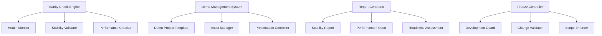
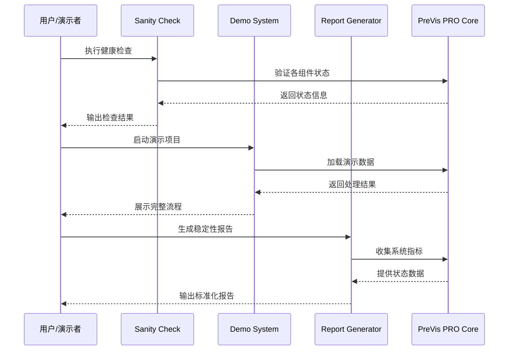

# MVP验证系统设计文档

## 概述

MVP验证系统是PreVis PRO从工程稳定性向产品交付转换的关键基础设施。该系统不扩展功能，而是建立一套完整的质量保障、演示准备和交付验证机制，确保系统随时处于生产就绪状态。

## 架构

### 系统组件架构



### 数据流架构



## 组件和接口

### 1. Sanity Check Engine

#### 核心接口
```python
class SanityCheckEngine:
    def run_full_check(self) -> CheckResult
    def check_backend_health(self) -> ComponentStatus
    def check_frontend_availability(self) -> ComponentStatus
    def check_database_connectivity(self) -> ComponentStatus
    def check_vector_consistency(self) -> ComponentStatus
    def check_async_behavior(self) -> ComponentStatus
```

#### 检查项定义
- **Backend Health**: GET /health 响应时间 < 3秒
- **Frontend Availability**: localhost:3000 可访问
- **Database Connectivity**: 创建/删除测试记录成功
- **Vector Consistency**: 384维度向量校验通过
- **Async Behavior**: 异步任务立即返回

### 2. Demo Management System

#### 演示项目结构
```
demo_projects/
├── cyberpunk_trailer/
│   ├── project.json          # 项目元数据
│   ├── script.txt           # 演示剧本
│   ├── beats.json           # 预生成Beat数据
│   ├── assets/              # 演示素材
│   │   ├── city_night.mp4
│   │   ├── rain_forest.mp4
│   │   └── closeup_shot.mp4
│   └── tags.json            # 标签映射
└── demo_controller.py       # 演示控制器
```

#### Demo Controller接口
```python
class DemoController:
    def load_demo_project(self, project_name: str) -> DemoProject
    def execute_demo_flow(self) -> DemoResult
    def reset_demo_state(self) -> None
    def validate_demo_assets(self) -> ValidationResult
```

### 3. Report Generator

#### 报告模板系统
```python
class ReportGenerator:
    def generate_stability_report(self) -> StabilityReport
    def generate_performance_report(self) -> PerformanceReport
    def generate_readiness_assessment(self) -> ReadinessReport
    def export_report(self, format: str) -> str  # markdown, json, html
```

#### 报告数据模型
```python
@dataclass
class StabilityReport:
    timestamp: datetime
    overall_status: Literal["PASS", "FAIL"]
    p0_fixes_status: Dict[str, bool]
    performance_metrics: Dict[str, float]
    risk_assessment: List[str]
    recommendations: List[str]
```

### 4. Freeze Controller

#### 开发约束接口
```python
class FreezeController:
    def validate_change_request(self, change: ChangeRequest) -> ValidationResult
    def enforce_scope_limits(self, operation: str) -> bool
    def generate_freeze_prompt(self) -> str
    def check_compliance(self, code_changes: List[str]) -> ComplianceResult
```

## 数据模型

### 检查结果模型
```python
@dataclass
class CheckResult:
    overall_status: Literal["PASS", "FAIL"]
    component_results: Dict[str, ComponentStatus]
    execution_time: float
    timestamp: datetime
    error_details: Optional[List[str]]

@dataclass
class ComponentStatus:
    name: str
    status: Literal["OK", "FAIL", "WARNING"]
    response_time: float
    details: str
    error_message: Optional[str]
```

### 演示项目模型
```python
@dataclass
class DemoProject:
    name: str
    description: str
    script_content: str
    beats: List[Beat]
    assets: List[DemoAsset]
    tags: Dict[str, List[str]]
    flow_steps: List[DemoStep]

@dataclass
class DemoAsset:
    id: str
    filename: str
    type: Literal["video", "audio", "image"]
    proxy_path: str
    thumbnail_path: str
    tags: List[str]
    description: str
```

## 正确性属性

*正确性属性是系统行为的形式化规范，用于验证系统在所有有效执行中都满足预期行为。*

### Property 1: 健康检查完整性
*对于任何* 系统状态，当执行完整健康检查时，所有关键组件都应被验证，且检查结果应准确反映系统可用性
**验证: 需求 1.1, 1.2, 1.3, 1.4, 1.5**

### Property 2: 演示流程一致性
*对于任何* 演示项目，执行标准演示流程应始终产生相同的结果序列，且每个步骤都应在预期时间内完成
**验证: 需求 2.1, 2.2, 2.3, 2.4, 2.5**

### Property 3: 报告数据准确性
*对于任何* 系统状态快照，生成的稳定性报告应准确反映当前P0修复状态和系统性能指标
**验证: 需求 3.1, 3.2, 3.3, 3.4, 3.5, 3.6**

### Property 4: 冻结模式约束性
*对于任何* 代码变更请求，冻结控制器应正确识别并拒绝超出允许范围的修改
**验证: 需求 4.1, 4.2, 4.3, 4.4, 4.5, 4.6**

### Property 5: 演示素材完整性
*对于任何* 演示项目，所有引用的素材文件都应在本地可用且格式正确
**验证: 需求 5.1, 5.2, 5.3, 5.4, 5.5**

### Property 6: 系统稳定性持续性
*对于任何* 连续运行周期，系统应保持响应性能和数据一致性不降级
**验证: 需求 6.1, 6.2, 6.3, 6.4, 6.5, 6.6**

### Property 7: 文档同步性
*对于任何* 系统状态变更，相关文档应自动更新以保持与实际状态的一致性
**验证: 需求 7.1, 7.2, 7.3, 7.4, 7.5, 7.6**

### Property 8: 版本验证完整性
*对于任何* 新版本发布，都应通过完整的Sanity Check和演示验证流程
**验证: 需求 8.1, 8.2, 8.3, 8.4, 8.5, 8.6**

## 错误处理

### 健康检查错误处理
- **组件不可达**: 立即失败，输出明确错误信息
- **响应超时**: 3秒超时，标记为FAIL状态
- **数据不一致**: 记录详细错误，提供修复建议
- **依赖缺失**: 检查并报告缺失的依赖项

### 演示系统错误处理
- **素材缺失**: 提供备用素材或降级演示
- **加载失败**: 重试机制，最多3次尝试
- **性能降级**: 自动调整演示复杂度
- **用户误操作**: 优雅处理，提供操作指导

### 报告生成错误处理
- **数据收集失败**: 使用缓存数据或默认值
- **格式化错误**: 提供纯文本备用格式
- **导出失败**: 多格式备用选项
- **权限问题**: 明确提示权限要求

## 测试策略

### 单元测试覆盖
- Sanity Check各组件独立测试
- Demo Controller功能测试
- Report Generator输出验证
- Freeze Controller约束测试

### 集成测试重点
- 完整健康检查流程
- 端到端演示流程
- 报告生成和导出
- 系统状态变更响应

### 性能测试要求
- 健康检查执行时间 < 30秒
- 演示项目加载时间 < 5秒
- 报告生成时间 < 10秒
- 系统响应时间 < 500ms

### 可靠性测试
- 连续运行稳定性测试
- 错误恢复能力测试
- 资源限制下的行为测试
- 并发访问压力测试

## 部署和配置

### 环境要求
- Python 3.8+
- Node.js 16+
- 本地文件系统访问权限
- 网络端口 3000, 8000 可用

### 配置文件结构
```yaml
# mvp_validation_config.yaml
sanity_check:
  timeout: 30
  retry_count: 3
  components:
    - backend
    - frontend
    - database
    - vectors

demo_system:
  default_project: "cyberpunk_trailer"
  asset_path: "./demo_assets"
  auto_reset: true

reporting:
  output_format: ["markdown", "json"]
  include_metrics: true
  export_path: "./reports"

freeze_mode:
  enabled: true
  allowed_changes:
    - "sanity_check"
    - "demo_optimization"
    - "stability_fixes"
```

### 部署检查清单
- [ ] 所有依赖项已安装
- [ ] 演示素材已准备就绪
- [ ] 配置文件已正确设置
- [ ] 健康检查脚本可执行
- [ ] 报告输出目录可写
- [ ] 系统权限配置正确

## 监控和维护

### 关键指标监控
- 健康检查成功率
- 演示流程完成率
- 系统响应时间
- 错误发生频率
- 资源使用情况

### 维护任务
- 定期更新演示素材
- 验证文档同步性
- 检查配置文件有效性
- 清理临时文件和日志
- 更新依赖项版本

### 故障排除指南
- 健康检查失败 → 检查服务状态
- 演示加载缓慢 → 检查素材文件大小
- 报告生成错误 → 验证输出权限
- 系统响应超时 → 检查资源占用

这个设计确保了MVP验证系统能够有效支撑PreVis PRO从工程稳定性向产品交付的关键转换，为系统的可信度和可演示性提供坚实保障。