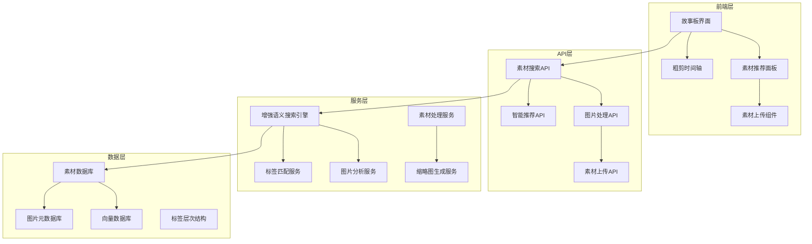

# 故事板素材增强系统设计文档

## 概述

当前PreVis PRO的故事板功能存在素材匹配不足的问题，主要表现为：
1. 节拍(Beat)中缺乏合适的视频和图片素材
2. 素材匹配算法不够智能，无法准确推荐相关内容
3. 缺乏图片素材支持，限制了故事板的完整性
4. 用户无法方便地上传和管理新素材来填补空缺

本设计旨在通过改进素材匹配算法、增强图片支持、优化用户体验来解决这些问题。

## 架构

### 系统架构图



## 组件和接口

### 1. 增强语义搜索引擎

#### 接口设计
```python
class EnhancedSemanticSearchEngine:
    async def search_for_beat(
        self, 
        beat: Beat, 
        media_types: List[str] = ["video", "image"],
        limit: int = 10,
        min_score: float = 0.6
    ) -> SearchResult
    
    async def search_mixed_media(
        self,
        query: str,
        emotion_tags: List[str],
        scene_tags: List[str],
        media_types: List[str]
    ) -> List[AssetMatch]
```

#### 核心功能
- 支持视频和图片的统一搜索
- 基于多维度标签的智能匹配
- 动态调整匹配阈值
- 提供匹配度解释

### 2. 图片素材处理服务

#### 接口设计
```python
class ImageAssetProcessor:
    async def process_image(self, image_path: str) -> ImageAsset
    async def extract_visual_features(self, image_path: str) -> VisualFeatures
    async def generate_image_tags(self, image_path: str) -> List[str]
    async def create_thumbnail(self, image_path: str, size: Tuple[int, int]) -> str
```

#### 处理流程
1. 图片上传和格式验证
2. 生成多尺寸缩略图
3. 提取视觉特征（颜色、构图、风格）
4. AI标签生成和分类
5. 创建搜索向量

### 3. 故事板素材推荐组件

#### React组件设计
```typescript
interface StoryboardAssetRecommendation {
  beatId: string;
  recommendations: AssetRecommendation[];
  onAssetSelect: (asset: Asset) => void;
  onUploadRequest: () => void;
}

interface AssetRecommendation {
  asset: Asset;
  matchScore: number;
  matchReason: string;
  previewUrl: string;
  thumbnailUrl: string;
}
```

## 数据模型

### 扩展的素材模型

```sql
-- 扩展Asset表支持图片
ALTER TABLE assets ADD COLUMN media_type VARCHAR(20) DEFAULT 'video';
ALTER TABLE assets ADD COLUMN image_width INTEGER;
ALTER TABLE assets ADD COLUMN image_height INTEGER;
ALTER TABLE assets ADD COLUMN color_palette JSON;
ALTER TABLE assets ADD COLUMN visual_style_tags JSON;

-- 新增图片元数据表
CREATE TABLE image_metadata (
    id UUID PRIMARY KEY,
    asset_id UUID REFERENCES assets(id),
    dominant_colors JSON,
    composition_type VARCHAR(50),
    lighting_type VARCHAR(50),
    mood_score FLOAT,
    style_tags JSON,
    created_at TIMESTAMP DEFAULT NOW()
);

-- 素材匹配历史表
CREATE TABLE asset_matches (
    id UUID PRIMARY KEY,
    beat_id UUID REFERENCES beats(id),
    asset_id UUID REFERENCES assets(id),
    match_score FLOAT,
    match_reason TEXT,
    user_feedback INTEGER, -- 1: 好, 0: 一般, -1: 差
    created_at TIMESTAMP DEFAULT NOW()
);
```

## 正确性属性

*一个属性是一个特征或行为，应该在系统的所有有效执行中保持为真——本质上，是关于系统应该做什么的正式陈述。属性作为人类可读规范和机器可验证正确性保证之间的桥梁。*

### 属性1: 素材推荐完整性
*对于任何*故事板节拍，当请求素材推荐时，系统应该返回至少一个匹配的素材（视频或图片），如果素材库中存在任何相关内容
**验证: 需求1.1, 1.3**

### 属性2: 图片素材处理一致性
*对于任何*上传的有效图片文件，系统应该生成缩略图、提取标签，并使其可在故事板中搜索到
**验证: 需求2.1, 2.2, 2.4**

### 属性3: 混合媒体时间轴完整性
*对于任何*包含图片和视频的粗剪时间轴，渲染后的输出应该正确处理所有媒体类型的时长和转场
**验证: 需求6.1, 6.4**

### 属性4: 标签匹配准确性
*对于任何*具有明确标签的节拍，推荐的素材应该至少匹配一个相关标签，匹配度应该反映标签重叠程度
**验证: 需求1.2, 7.1**

### 属性5: 素材上传处理幂等性
*对于任何*素材文件，多次上传同一文件应该产生相同的处理结果（标签、缩略图、向量）
**验证: 需求3.3, 3.4**

## 错误处理

### 素材匹配失败处理
- 当没有找到匹配素材时，提供上传建议
- 降级到基于关键词的简单匹配
- 显示最相似的替代选项

### 图片处理错误处理
- 不支持的格式自动转换
- 损坏文件的检测和报告
- 处理超时的重试机制

### 搜索性能优化
- 向量搜索结果缓存
- 分页加载大量结果
- 异步处理耗时操作

## 测试策略

### 单元测试
- 图片处理功能测试
- 标签匹配算法测试
- 向量相似度计算测试

### 集成测试
- 端到端故事板创建流程
- 素材上传和处理流程
- 混合媒体时间轴渲染

### 属性测试
- 使用随机生成的节拍内容测试推荐完整性
- 使用各种图片格式测试处理一致性
- 使用不同媒体组合测试时间轴完整性

### 性能测试
- 大量素材库的搜索性能
- 并发用户的推荐响应时间
- 图片处理的内存使用

## 实现计划

### 阶段1: 图片素材支持
1. 扩展数据模型支持图片
2. 实现图片上传和处理
3. 集成图片到搜索系统

### 阶段2: 增强推荐算法
1. 改进语义搜索引擎
2. 实现多维度标签匹配
3. 添加用户反馈学习

### 阶段3: 用户体验优化
1. 重新设计故事板界面
2. 添加素材推荐面板
3. 实现拖拽上传功能

### 阶段4: 混合媒体时间轴
1. 扩展时间轴支持图片
2. 实现图片转场效果
3. 优化渲染性能

## 部署考虑

### 存储需求
- 图片文件存储空间规划
- 缩略图缓存策略
- 向量数据库性能优化

### 计算资源
- 图片处理的CPU需求
- AI模型推理的GPU需求
- 并发处理的内存需求

### 监控指标
- 素材匹配成功率
- 用户满意度反馈
- 系统响应时间
- 存储使用情况