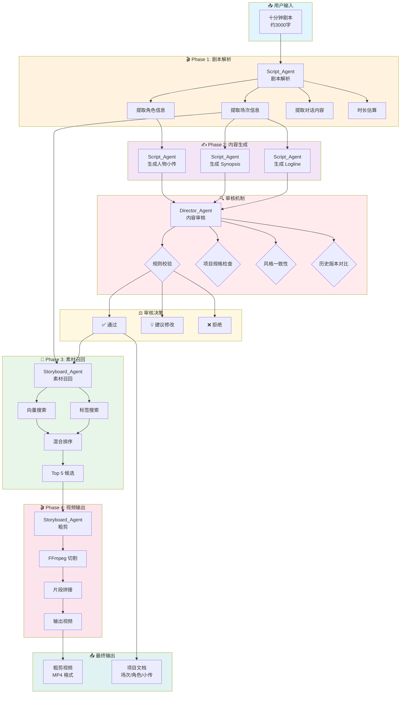
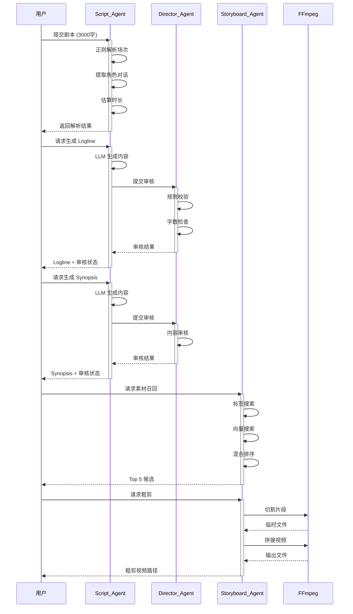
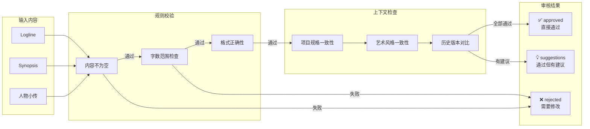

# Pervis PRO 完整工作流程图

生成时间: 2025-12-27 01:06:34

## 数据流转和审核机制

## 详细数据流转

## 审核机制详解

## 本次测试结果

| 步骤 | Agent | 状态 | 耗时 |
|------|-------|------|------|
| 健康检查 | System | ✅ completed | 2041ms |
| 剧本解析 | Script_Agent | ✅ completed | 8ms |
| 生成 Logline | Script_Agent | ✅ completed | 3ms |
| 生成 Synopsis | Script_Agent | ✅ completed | 1ms |
| 生成人物小传 | Script_Agent | ✅ completed | 5ms |
| 内容审核 | Director_Agent | ✅ completed | 2ms |
| 素材召回 | Storyboard_Agent | ✅ completed | 7860ms |
| 粗剪视频 | Storyboard_Agent | ✅ completed | 0ms |

## 关键数据

- **项目ID**: test_project_20251227_010624
- **剧本长度**: 2076 字符
- **测试时间**: 2025-12-27 01:06:34
