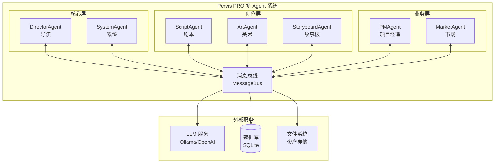
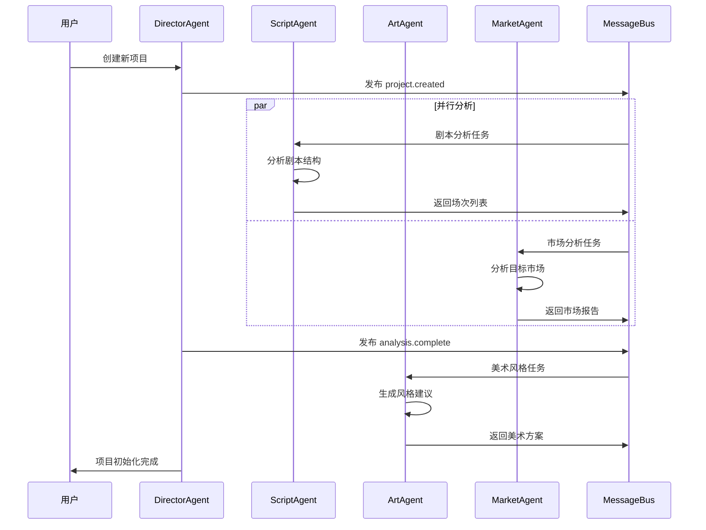
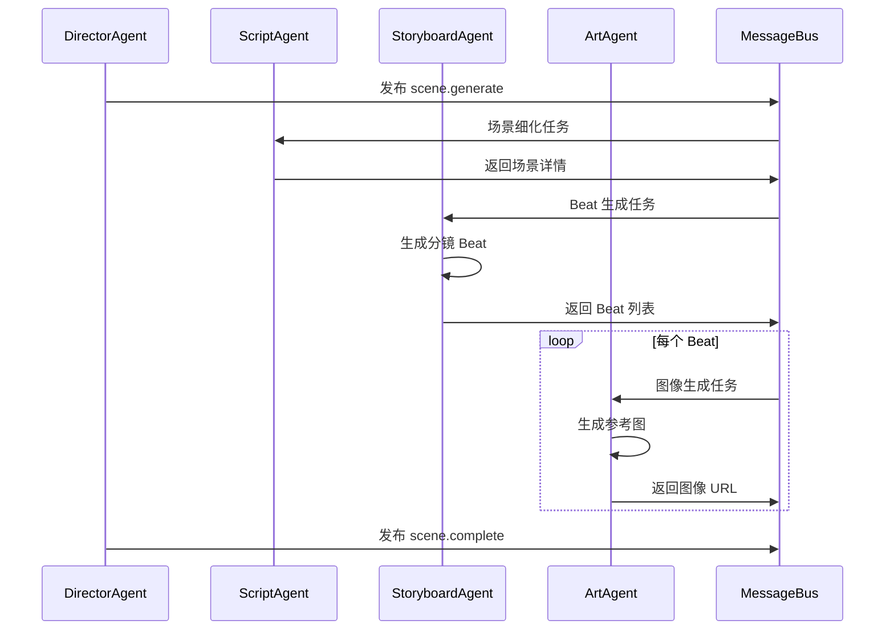

# Pervis PRO 多 Agent 架构文档

## 概述

Pervis PRO 采用多 Agent 协作架构，通过消息总线实现 Agent 间的松耦合通信。本文档描述系统的核心组件、Agent 类型及其协作流程。

## 核心组件

### 1. 消息总线 (MessageBus)

消息总线是 Agent 间通信的核心基础设施，提供：

- **发布/订阅模式**: Agent 可以订阅特定主题，接收相关消息
- **直接消息**: 支持点对点的直接消息发送
- **消息优先级**: 支持 LOW、NORMAL、HIGH、URGENT 四级优先级
- **消息历史**: 保留消息历史记录，支持回溯查询

```python
from core import MessageBus, Message, MessageType, MessagePriority

# 创建消息总线
bus = MessageBus(max_history=1000)
await bus.start()

# 订阅主题
await bus.subscribe(agent_id, "topic.name", handler)

# 发布消息
await bus.publish("topic.name", message)
```

### 2. 通信协议 (CommunicationProtocol)

标准化的 Agent 间通信协议，定义消息格式和交互模式：

- **协议消息类型**: PING、TASK_ASSIGNMENT、DATA_REQUEST、AGENT_STATUS 等
- **协议状态**: SUCCESS、ERROR、PENDING、TIMEOUT
- **请求-响应模式**: 支持同步等待响应

### 3. Agent 基类 (BaseAgent)

所有 Agent 的抽象基类，提供：

- **生命周期管理**: CREATED → READY → RUNNING → STOPPED
- **状态管理**: IDLE、WORKING、WAITING、REVIEWING、ERROR、OFFLINE
- **消息处理**: 统一的消息接收和处理接口
- **操作日志**: 自动记录 Agent 操作历史

```python
from core import BaseAgent, AgentType, AgentState

class MyAgent(BaseAgent):
    async def handle_message(self, message):
        # 处理普通消息
        pass
    
    async def handle_protocol_message(self, message):
        # 处理协议消息
        pass
```

## Agent 类型

### 核心 Agent

| Agent | 类型 | 职责 |
|-------|------|------|
| DirectorAgent | DIRECTOR | 总协调，任务分配，流程控制 |
| SystemAgent | SYSTEM | 系统健康检查，通知管理，后台任务 |

### 创作 Agent

| Agent | 类型 | 职责 |
|-------|------|------|
| ScriptAgent | SCRIPT | 剧本分析，场次拆分，对白提取 |
| ArtAgent | ART | 视觉风格定义，参考图生成，美术指导 |
| StoryboardAgent | STORYBOARD | Beat 生成，分镜设计，时间线规划 |

### 业务 Agent

| Agent | 类型 | 职责 |
|-------|------|------|
| PMAgent | PM | 项目进度管理，资源协调，里程碑跟踪 |
| MarketAgent | MARKET | 市场分析，竞品研究，受众定位 |

## 系统架构图




## Agent 协作流程

### 项目创建流程



### 内容生成流程



## 消息主题规范

### 系统主题

| 主题 | 描述 |
|------|------|
| `agent.{agent_id}` | Agent 专属主题 |
| `agent.broadcast` | 全局广播主题 |
| `system.health` | 系统健康状态 |
| `system.notification` | 系统通知 |

### 业务主题

| 主题 | 描述 |
|------|------|
| `project.created` | 项目创建事件 |
| `project.updated` | 项目更新事件 |
| `scene.generate` | 场景生成请求 |
| `scene.complete` | 场景完成事件 |
| `asset.uploaded` | 资产上传事件 |

## 开发指南

### 创建新 Agent

1. 在 `backend/services/agents/` 创建新文件
2. 继承 `BaseAgent` 基类
3. 实现 `handle_message` 和 `handle_protocol_message` 方法
4. 在 `AgentType` 枚举中添加新类型（如需要）

```python
# backend/services/agents/my_agent.py
from core import BaseAgent, AgentType, Message
from core.communication_protocol import ProtocolMessage

class MyAgentService(BaseAgent):
    def __init__(self, message_bus_instance=None):
        super().__init__(
            agent_id="my_agent",
            agent_type=AgentType.CUSTOM,  # 需要在 AgentType 中定义
            message_bus_instance=message_bus_instance,
            capabilities=["capability1", "capability2"]
        )
    
    async def handle_message(self, message: Message):
        # 处理业务消息
        if message.topic == "my.topic":
            await self._process_my_task(message.content)
    
    async def handle_protocol_message(self, message: ProtocolMessage):
        # 处理协议消息
        return message.create_response(ProtocolStatus.SUCCESS, data={})
```

### 测试 Agent

使用属性测试验证 Agent 行为：

```python
# backend/tests/test_my_agent_properties.py
from hypothesis import given, strategies as st, settings

class TestMyAgentProperties:
    @pytest.mark.asyncio
    @settings(max_examples=100, deadline=None)
    @given(input_data=st.text(alphabet='abcdefghijklmnopqrstuvwxyz'))
    async def test_agent_handles_input(self, input_data):
        # 测试 Agent 处理各种输入
        pass
```

## 文件结构

```
Pervis PRO/backend/
├── core/                           # 核心组件
│   ├── __init__.py                 # 模块导出
│   ├── message_bus.py              # 消息总线实现
│   ├── base_agent.py               # Agent 基类
│   ├── agent_types.py              # Agent 类型枚举
│   └── communication_protocol.py   # 通信协议
├── services/
│   └── agents/                     # Agent 实现
│       ├── director_agent.py       # 导演 Agent
│       ├── system_agent.py         # 系统 Agent
│       ├── script_agent.py         # 剧本 Agent
│       ├── art_agent.py            # 美术 Agent
│       ├── storyboard_agent.py     # 故事板 Agent
│       ├── pm_agent.py             # 项目经理 Agent
│       └── market_agent.py         # 市场 Agent
└── tests/                          # 测试文件
    ├── test_message_bus_properties.py
    └── test_agent_initialization_properties.py
```

## 迁移说明

本架构从 `multi-agent-workflow` 项目整合而来，主要变更：

1. **导入路径变更**: `app.core.*` → `core.*`
2. **Agent 命名规范**: 使用 `*AgentService` 后缀
3. **参数名称**: `message_bus` → `message_bus_instance`
4. **测试适配**: 更新 Hypothesis 策略使用显式字符集

---

*文档版本: 1.0*  
*最后更新: 2025-12-27*
