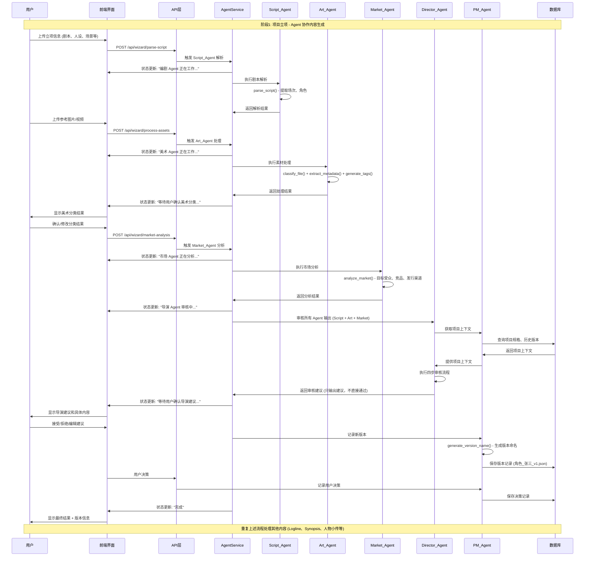
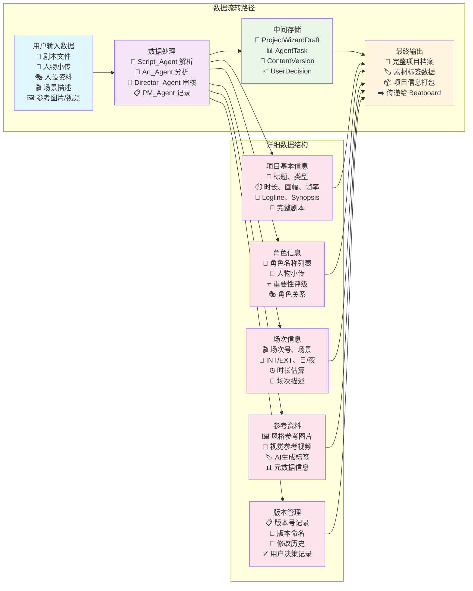

# Pervis PRO 项目立项向导系统 - 完整流程图示

> **文档版本**: v2.0 (2025-12-25)
> **状态**: Phase 0-4 后端 MVP 完成

---

## 📊 API 端点总览

| 端点 | 方法 | Agent | 功能 |
|------|------|-------|------|
| `/api/wizard/parse-script` | POST | Script_Agent | 剧本解析 |
| `/api/wizard/generate-content` | POST | Script_Agent/Art_Agent | 内容生成 |
| `/api/wizard/process-assets` | POST | Art_Agent | 素材处理 |
| `/api/wizard/review-content` | POST | Director_Agent | 内容审核 |
| `/api/wizard/recall-assets` | POST | Storyboard_Agent | 素材召回 |
| `/api/wizard/switch-candidate` | POST | Storyboard_Agent | 候选切换 |
| `/api/wizard/cached-candidates/{scene_id}` | GET | Storyboard_Agent | 获取缓存候选 |
| `/api/wizard/record-version` | POST | PM_Agent | 记录版本 |
| `/api/wizard/version-history/{project_id}` | GET | PM_Agent | 版本历史 |
| `/api/wizard/restore-version/{version_id}` | POST | PM_Agent | 恢复版本 |
| `/api/wizard/version-display/{project_id}` | GET | PM_Agent | 版本显示信息 |
| `/api/wizard/market-analysis` | POST | Market_Agent | 市场分析 |
| `/api/wizard/market-analysis/{project_id}` | GET | Market_Agent | 获取分析结果 |
| `/api/wizard/validate-export` | POST | System_Agent | 导出前校验 |
| `/api/wizard/check-tag-consistency` | POST | System_Agent | 标签一致性检查 |
| `/api/wizard/api-health` | GET | System_Agent | API 健康检查 |
| `/api/wizard/create-project` | POST | - | 创建项目 |
| `/api/wizard/validate-project` | POST | - | 验证项目 |
| `/api/wizard/project/{project_id}` | GET/PUT/DELETE | - | 项目 CRUD |
| `/api/wizard/projects` | GET | - | 项目列表 |
| `/api/wizard/task-status/{task_id}` | GET | - | 任务状态 |
| `/api/wizard/health` | GET | - | 基础健康检查 |
| `/api/wizard/health-full` | GET | - | 完整健康检查 |

---

## 系统整体架构图

```mermaid
graph TB
    %% 用户输入层
    subgraph "用户输入层"
        U1[用户上传立项信息]
        U2[散乱文件: 剧本、人物小传、人设、场景、参考内容等]
        U3[项目基本信息: 标题、类型、时长、画幅、帧率]
    end

    %% 前端界面层
    subgraph "前端界面层 (React)"
        PW[ProjectWizard 主组件]
        S1[Step1: 基本信息]
        S2[Step2: 剧本导入]
        S3[Step3: 角色设定]
        S4[Step4: 场次规划]
        S5[Step5: 参考资料]
        S6[Step6: 确认提交]
        
        ASP[AgentStatusPanel<br/>Agent状态面板]
        VHP[VersionHistoryPanel<br/>版本历史面板<br/>📋 显示版本号<br/>📋 显示修改历史<br/>📋 恢复历史版本]
        MCD[MissingContentDialog<br/>缺失内容处理]
        PP[ProjectPreview<br/>项目预览]
    end

    %% API 层
    subgraph "API 层 (FastAPI)"
        API1[POST /api/wizard/parse-script]
        API2[POST /api/wizard/generate-content]
        API3[POST /api/wizard/process-assets]
        API4[GET /api/wizard/task-status/{id}]
        API5[GET /api/wizard/version-history/{project_id}]
        API6[POST /api/wizard/restore-version/{version_id}]
        API7[GET /api/wizard/version-display/{project_id}]
    end

    %% Agent 服务层
    subgraph "Agent 服务层"
        AS[AgentService<br/>Agent 任务调度器]
        
        subgraph "Script_Agent (编剧 Agent)"
            SA1[parse_script<br/>剧本解析]
            SA2[generate_logline<br/>Logline 生成]
            SA3[generate_synopsis<br/>Synopsis 生成]
            SA4[generate_character_bio<br/>人物小传生成]
            SA5[estimate_scene_duration<br/>时长估算]
        end
        
        subgraph "Art_Agent (美术 Agent)"
            AA1[classify_file<br/>文件分类]
            AA2[extract_metadata<br/>元数据提取]
            AA3[generate_tags<br/>标签生成]
            AA4[create_thumbnail<br/>缩略图生成]
        end
        
        subgraph "Market_Agent (市场 Agent)"
            MA1[analyze_market<br/>市场分析]
            MA2[target_audience<br/>目标受众分析]
            MA3[competitor_analysis<br/>竞品分析]
            MA4[distribution_channels<br/>发行渠道建议]
        end
        
        subgraph "Director_Agent (导演 Agent) - 有项目记忆"
            DA1[review<br/>审核所有 Agent 输出]
            DA2[check_rules<br/>规则校验]
            DA3[check_project_specs<br/>项目规格一致性检查]
            DA4[check_style_consistency<br/>艺术风格一致性检查]
            DA5[compare_with_history<br/>历史版本对比]
        end
        
        subgraph "PM_Agent (项目助理) - 用户可见"
            PA1[get_project_context<br/>获取项目上下文]
            PA2[record_version<br/>记录版本]
            PA3[record_decision<br/>记录用户决策]
            PA4[generate_version_name<br/>生成版本命名<br/>📝 角色_张三_v3.json]
            PA5[get_version_display_info<br/>获取版本显示信息]
        end
        
        subgraph "System_Agent (系统 Agent)"
            SYA1[validate_export<br/>导出前校验]
            SYA2[check_consistency<br/>标签一致性检查]
            SYA3[api_health_check<br/>API 健康检查]
            SYA4[ui_bug_detection<br/>UI 问题检测]
        end
    end

    %% 数据存储层
    subgraph "数据存储层"
        DB1[(ProjectWizardDraft<br/>项目建档草稿)]
        DB2[(ProjectTemplate<br/>项目模板)]
        DB3[(AgentTask<br/>Agent 任务记录)]
        DB4[(ProjectContext<br/>项目上下文)]
        DB5[(ContentVersion<br/>版本历史)]
        DB6[(UserDecision<br/>用户决策)]
        DB7[(Assets<br/>素材库)]
    end

    %% 输出层
    subgraph "输出层"
        O1[完整项目档案]
        O2[项目信息打包]
        O3[素材标签数据]
        O4[跳转到 Beatboard 阶段]
    end

    %% 连接关系
    U1 --> PW
    U2 --> PW
    U3 --> PW
    
    PW --> S1
    PW --> S2
    PW --> S3
    PW --> S4
    PW --> S5
    PW --> S6
    
    S2 --> API1
    S3 --> API2
    S4 --> API2
    S5 --> API3
    
    VHP --> API5
    VHP --> API6
    VHP --> API7
    
    API1 --> AS
    API2 --> AS
    API3 --> AS
    API4 --> AS
    API5 --> PA5
    API6 --> PA2
    API7 --> PA5
    
    AS --> SA1
    AS --> SA2
    AS --> SA3
    AS --> SA4
    AS --> SA5
    AS --> AA1
    AS --> AA2
    AS --> AA3
    AS --> AA4
    AS --> MA1
    AS --> MA2
    AS --> MA3
    AS --> MA4
    
    %% 工作流程：美术确认 → 市场分析 → 导演审核
    AA1 --> MA1
    AA2 --> MA1
    AA3 --> MA1
    AA4 --> MA1
    
    SA1 --> DA1
    SA2 --> DA1
    SA3 --> DA1
    SA4 --> DA1
    SA5 --> DA1
    MA1 --> DA1
    MA2 --> DA1
    MA3 --> DA1
    MA4 --> DA1
    
    DA1 --> DA2
    DA1 --> DA3
    DA1 --> DA4
    DA1 --> DA5
    
    DA3 --> PA1
    DA4 --> PA1
    DA5 --> PA1
    
    PA2 --> DB5
    PA3 --> DB6
    PA1 --> DB4
    
    AS --> DB3
    PW --> DB1
    S6 --> DB2
    AA3 --> DB7
    SYA1 --> O1
    
    S6 --> O1
    O1 --> O2
    O2 --> O3
    O3 --> O4

    %% 样式
    classDef userInput fill:#e1f5fe
    classDef frontend fill:#f3e5f5
    classDef api fill:#e8f5e8
    classDef agent fill:#fff3e0
    classDef database fill:#fce4ec
    classDef output fill:#e0f2f1

    class U1,U2,U3 userInput
    class PW,S1,S2,S3,S4,S5,S6,ASP,VHP,MCD,PP frontend
    class API1,API2,API3,API4,API5,API6,API7 api
    class AS,SA1,SA2,SA3,SA4,SA5,AA1,AA2,AA3,AA4,MA1,MA2,MA3,MA4,DA1,DA2,DA3,DA4,DA5,PA1,PA2,PA3,PA4,PA5,SYA1,SYA2,SYA3,SYA4 agent
    class DB1,DB2,DB3,DB4,DB5,DB6,DB7 database
    class O1,O2,O3,O4 output
```

## Agent 协作工作流程详细图



## PM_Agent 版本管理详细流程

```mermaid
graph TB
    subgraph "PM_Agent 版本管理系统"
        %% 版本记录流程
        VR1[Agent 生成新内容]
        VR2[PM_Agent.record_version()]
        VR3[生成版本命名<br/>角色_张三_v1.json]
        VR4[保存到 ContentVersion 表]
        
        %% 用户决策记录
        UD1[用户做出决策<br/>接受/拒绝/修改]
        UD2[PM_Agent.record_decision()]
        UD3[保存到 UserDecision 表]
        
        %% 版本显示
        VD1[前端请求版本信息]
        VD2[PM_Agent.get_version_display_info()]
        VD3[VersionHistoryPanel 显示]
        VD4[当前版本: v3<br/>最后修改: 2024-01-15<br/>修改历史列表]
        
        %% 版本恢复
        VRS1[用户选择恢复历史版本]
        VRS2[POST /api/wizard/restore-version/v2]
        VRS3[PM_Agent 恢复指定版本]
        VRS4[更新项目内容]
        
        %% Director_Agent 使用历史
        DH1[Director_Agent 审核时]
        DH2[PM_Agent.get_project_context()]
        DH3[提供历史版本对比数据]
        DH4[避免改回被否决的版本]
    end

    %% 连接关系
    VR1 --> VR2
    VR2 --> VR3
    VR3 --> VR4
    
    UD1 --> UD2
    UD2 --> UD3
    
    VD1 --> VD2
    VD2 --> VD3
    VD3 --> VD4
    
    VRS1 --> VRS2
    VRS2 --> VRS3
    VRS3 --> VRS4
    
    DH1 --> DH2
    DH2 --> DH3
    DH3 --> DH4

    %% 样式
    classDef version fill:#e3f2fd
    classDef decision fill:#f1f8e9
    classDef display fill:#fce4ec
    classDef restore fill:#fff3e0
    classDef director fill:#f3e5f5

    class VR1,VR2,VR3,VR4 version
    class UD1,UD2,UD3 decision
    class VD1,VD2,VD3,VD4 display
    class VRS1,VRS2,VRS3,VRS4 restore
    class DH1,DH2,DH3,DH4 director
```

## Director_Agent 审核机制详细图

```mermaid
graph TB
    subgraph "Director_Agent 四步审核流程"
        %% 输入
        INPUT[Script_Agent/Art_Agent 生成内容]
        
        %% Step 1: 规则校验
        S1[Step 1: 规则校验]
        S1A[内容不为空?]
        S1B[字数在合理范围?]
        S1C[格式正确?]
        
        %% Step 2: 项目规格一致性
        S2[Step 2: 项目规格一致性检查]
        S2A[从 PM_Agent 获取项目规格]
        S2B[时长符合项目设定?]
        S2C[画幅符合项目设定?]
        S2D[帧率符合项目设定?]
        
        %% Step 3: 艺术风格一致性
        S3[Step 3: 艺术风格一致性检查]
        S3A[从 PM_Agent 获取艺术风格]
        S3B[符合已确定的视觉风格?]
        S3C[符合对标项目调性?]
        S3D[使用 LLM 评估一致性]
        
        %% Step 4: 历史版本对比
        S4[Step 4: 历史版本对比]
        S4A[从 PM_Agent 获取历史版本]
        S4B[与被否决版本相似?]
        S4C[与已确认内容矛盾?]
        S4D[避免改回第一版问题]
        
        %% 审核结果
        PASS[审核通过<br/>返回结果给用户]
        SUGGEST[审核通过<br/>但有改进建议]
        REJECT[审核不通过<br/>返回具体问题]
    end

    %% 连接关系
    INPUT --> S1
    S1 --> S1A
    S1A --> S1B
    S1B --> S1C
    
    S1C --> S2
    S2 --> S2A
    S2A --> S2B
    S2B --> S2C
    S2C --> S2D
    
    S2D --> S3
    S3 --> S3A
    S3A --> S3B
    S3B --> S3C
    S3C --> S3D
    
    S3D --> S4
    S4 --> S4A
    S4A --> S4B
    S4B --> S4C
    S4C --> S4D
    
    S4D --> PASS
    S4D --> SUGGEST
    S1A --> REJECT
    S1B --> REJECT
    S1C --> REJECT

    %% 样式
    classDef step1 fill:#ffebee
    classDef step2 fill:#e8f5e8
    classDef step3 fill:#e3f2fd
    classDef step4 fill:#fff3e0
    classDef result fill:#f3e5f5

    class S1,S1A,S1B,S1C step1
    class S2,S2A,S2B,S2C,S2D step2
    class S3,S3A,S3B,S3C,S3D step3
    class S4,S4A,S4B,S4C,S4D step4
    class PASS,SUGGEST,REJECT result
```



## 数据流转详细图



## 关键功能标注说明

### 🔄 PM_Agent 版本管理功能
- **版本命名规则**: `{内容类型}_{名称}_v{版本号}.{扩展名}`
- **示例**: `角色_张三_v1.json` → `角色_张三_v2.json` → `角色_张三_v3.json`
- **用户可见**: 在 VersionHistoryPanel 中显示版本号、修改时间、修改历史
- **版本恢复**: 用户可以选择恢复到任意历史版本

### 🎯 Director_Agent 审核机制
1. **规则校验**: 内容完整性、格式正确性
2. **项目规格一致性**: 时长、画幅、帧率符合项目设定
3. **艺术风格一致性**: 使用 LLM 评估风格统一性
4. **历史版本对比**: 避免改回被否决的版本

### 🔄 Agent 工作流程顺序
1. **Script_Agent**: 剧本解析和内容生成
2. **Art_Agent**: 素材处理和分类 → **用户确认分类结果**
3. **Market_Agent**: 市场分析（在美术确认后执行）
4. **Director_Agent**: 审核所有 Agent 输出 → **只输出建议，需用户确认**
5. **PM_Agent**: 记录版本和用户决策
6. **System_Agent**: 导出前最终校验

### 🔗 数据衔接
- **立项阶段**: 生成完整项目档案和素材标签
- **Beatboard阶段**: 基于项目信息从素材库召回匹配的参考素材
- **数据传递**: 角色列表、场次信息、风格标签无缝传递

### 📊 Agent 状态显示
- **Script_Agent**: "编剧 Agent 正在工作..."
- **Art_Agent**: "美术 Agent 正在工作..." → "等待用户确认美术分类..."
- **Market_Agent**: "市场 Agent 正在分析..."
- **Director_Agent**: "导演 Agent 审核中..." → "等待用户确认导演建议..."
- **完成状态**: 显示结果摘要和用户操作选项

---

## 🔧 Agent 服务实现详情

### Script_Agent (编剧 Agent)
**文件**: `Pervis PRO/backend/services/agents/script_agent.py`

```python
class ScriptAgentService:
    def parse_script(script_content: str) -> ScriptParseResult
    async def generate_logline(script_content: str) -> str
    async def generate_synopsis(script_content: str) -> Dict
    async def generate_character_bio(character_name: str, script_content: str) -> Dict
    def estimate_scene_duration(scene: SceneInfo) -> float
```

**API 端点**:
- `POST /api/wizard/parse-script` → 调用 `parse_script()` + `generate_logline()` + `generate_synopsis()`
- `POST /api/wizard/generate-content` (content_type=logline/synopsis/character_bio)

---

### Art_Agent (美术 Agent)
**文件**: `Pervis PRO/backend/services/agents/art_agent.py`

```python
class ArtAgentService:
    def extract_metadata(file_path: str) -> Dict
    async def classify_file(file_path: str, metadata: Dict) -> ClassificationResult
    async def generate_tags(file_path: str) -> TagResult
    def create_thumbnail(file_path: str) -> str
```

**API 端点**:
- `POST /api/wizard/process-assets` → 调用 `classify_file()` + `generate_tags()`
- `POST /api/wizard/generate-content` (content_type=visual_tags)

---

### Director_Agent (导演 Agent) - 有项目记忆
**文件**: `Pervis PRO/backend/services/agents/director_agent.py`

```python
class DirectorAgentService:
    async def review(result: Any, task_type: str, project_id: str) -> ReviewResult
    def _check_rules(result: Any, task_type: str) -> List[str]
    def _check_project_specs(result: Any, project_id: str) -> List[str]
    async def _check_style_consistency(result: Any, project_id: str) -> List[str]
    def _compare_with_history(result: Any, project_id: str) -> List[str]
```

**四步审核流程**:
1. 规则校验 (内容不为空、字数合理、格式正确)
2. 项目规格一致性检查 (时长、画幅、帧率)
3. 艺术风格一致性检查 (LLM 评估)
4. 历史版本对比 (避免改回被否决版本)

**API 端点**:
- `POST /api/wizard/review-content`

---

### PM_Agent (项目管理 Agent) - 用户可见
**文件**: `Pervis PRO/backend/services/agents/pm_agent.py`

```python
class PMAgentService:
    def record_version(project_id, content_type, content, ...) -> VersionRecord
    def generate_version_name(content_type, entity_name, version_number) -> str
    def record_decision(project_id, decision_type, decision_data) -> DecisionRecord
    def get_version_display_info(project_id, content_type, entity_id) -> VersionDisplayInfo
    def restore_version(project_id, version_id) -> VersionRecord
    def approve_version(project_id, version_id) -> bool
    def reject_version(project_id, version_id, reason) -> bool
```

**版本命名规则**: `{内容类型}_{名称}_v{版本号}`
- 示例: `角色_张三_v1` → `角色_张三_v2` → `角色_张三_v3`

**API 端点**:
- `POST /api/wizard/record-version`
- `GET /api/wizard/version-history/{project_id}`
- `POST /api/wizard/restore-version/{version_id}`
- `GET /api/wizard/version-display/{project_id}`

---

### Storyboard_Agent (故事板 Agent)
**文件**: `Pervis PRO/backend/services/agents/storyboard_agent.py`

```python
class StoryboardAgentService:
    async def recall_assets(scene_id, query, tags, strategy) -> RecallResult
    def get_cached_candidates(scene_id) -> List[AssetCandidate]
    def switch_candidate(scene_id, from_rank, to_rank) -> AssetCandidate
    async def rough_cut(scene_id, asset_ids, output_path) -> str
    def _merge_and_rank(tag_results, vector_results) -> List[AssetCandidate]
```

**召回策略**:
- `tag_only`: 仅标签匹配
- `vector_only`: 仅向量搜索
- `hybrid`: 混合策略 (默认)

**API 端点**:
- `POST /api/wizard/recall-assets`
- `POST /api/wizard/switch-candidate`
- `GET /api/wizard/cached-candidates/{scene_id}`

---

### Market_Agent (市场分析 Agent)
**文件**: `Pervis PRO/backend/services/agents/market_agent.py`

```python
class MarketAgentService:
    async def analyze_market(project_id, project_data) -> MarketAnalysisResult
    def get_dynamic_analysis(project_data) -> Dict
    def _rule_based_analysis(project_data) -> MarketAnalysisResult
    def get_cached_analysis(project_id) -> MarketAnalysisResult
```

**分析内容**:
- 目标受众 (target_audience)
- 市场定位 (market_positioning)
- 竞品分析 (competitor_analysis)
- 发行渠道建议 (distribution_channels)

**API 端点**:
- `POST /api/wizard/market-analysis`
- `GET /api/wizard/market-analysis/{project_id}`

---

### System_Agent (系统校验 Agent)
**文件**: `Pervis PRO/backend/services/agents/system_agent.py`

```python
class SystemAgentService:
    async def validate_before_export(project_id, project_data) -> ValidationResult
    def check_tag_consistency(tags: List[str]) -> TagConsistencyResult
    def check_tag_match_percentage(tags, asset_tags) -> float
    async def check_api_health() -> List[EndpointHealthResult]
    async def check_page_errors(page_url) -> List[PageError]
    def get_validation_summary(result) -> str
```

**矛盾标签检测**:
- 室内/室外 (indoor/outdoor)
- 白天/夜晚 (day/night)
- 现代/古代 (modern/ancient)
- 真人/动画 (live_action/animation)

**API 端点**:
- `POST /api/wizard/validate-export`
- `POST /api/wizard/check-tag-consistency`
- `GET /api/wizard/api-health`

---

## 📁 文件结构

```
Pervis PRO/backend/
├── routers/
│   └── wizard.py                    # REST API 路由层 (1844 行)
├── services/
│   ├── agent_service.py             # Agent 任务调度器
│   ├── agent_llm_adapter.py         # LLM 服务适配层
│   ├── milvus_store.py              # 向量存储服务
│   ├── video_preprocessor.py        # 视频预处理服务
│   └── agents/
│       ├── script_agent.py          # Script_Agent 服务
│       ├── art_agent.py             # Art_Agent 服务
│       ├── director_agent.py        # Director_Agent 服务
│       ├── storyboard_agent.py      # Storyboard_Agent 服务
│       ├── pm_agent.py              # PM_Agent 服务
│       ├── market_agent.py          # Market_Agent 服务
│       └── system_agent.py          # System_Agent 服务
└── models/
    └── (待实现 Phase 3)
```

---

## ✅ 验证测试

**测试文件**: `Pervis PRO/test_wizard_complete_flow.py`

```bash
# 运行完整流程验证
py Pervis\ PRO/test_wizard_complete_flow.py
```

**测试结果**: 102 passed, 0 failed, 1 warning

---

## 🚀 下一步计划

### Phase 3: 后端数据模型 ✅ 已完成
- [x] ProjectWizardDraft 模型 - 向导草稿
- [x] ProjectTemplate 模型 - 项目模板（含 4 个系统预设）
- [x] AgentTask 模型 - Agent 任务记录
- [x] ProjectContext 相关模型 - 项目规格、风格上下文、版本记录、用户决策
- [x] 数据库迁移脚本 - 创建 8 个新表

### Phase 5-8: 前端组件 (待实现)
- [ ] ProjectWizard 主组件
- [ ] AgentStatusPanel
- [ ] VersionHistoryPanel
- [ ] MissingContentDialog
- [ ] CandidateSwitcher
- [ ] MarketAnalysisPanel

---

## 📊 当前完成度

| Phase | 状态 | 说明 |
|-------|------|------|
| Phase 0-Fix | ✅ 完成 | 框架修复 |
| Phase 0 | ✅ 完成 | 基础设施 |
| Phase 1 | ✅ 完成 | 素材预处理管道 |
| Phase 2 | ✅ 完成 | AgentService 层 (8 个 Agent) |
| Phase 3 | ✅ 完成 | 后端数据模型 (8 个表) |
| Phase 4 | ✅ 完成 | API 端点 (23 个) |
| Phase 5-8 | ❌ 待开发 | 前端组件 |

**后端 MVP 完成度: 100%**